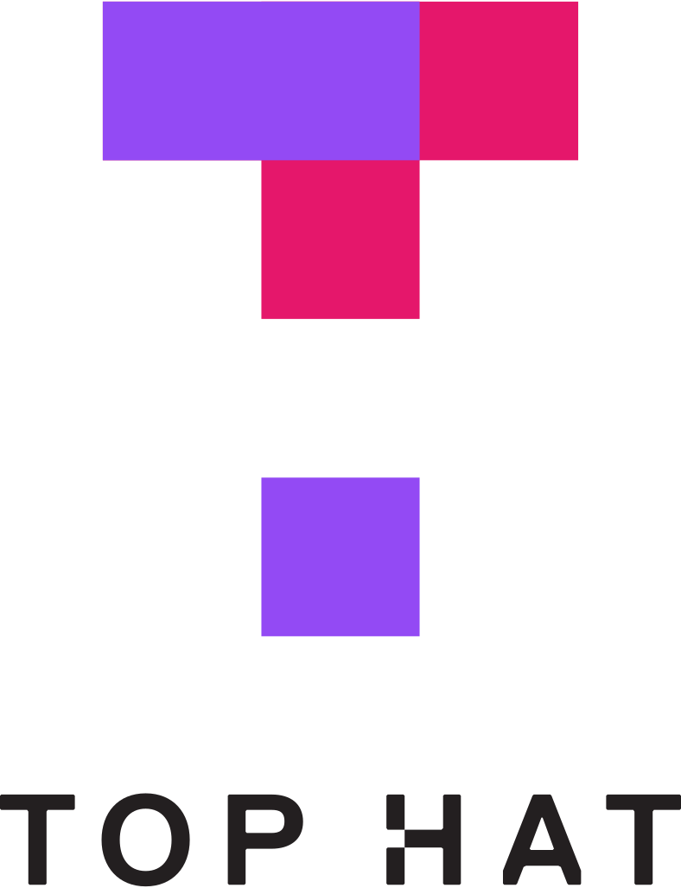
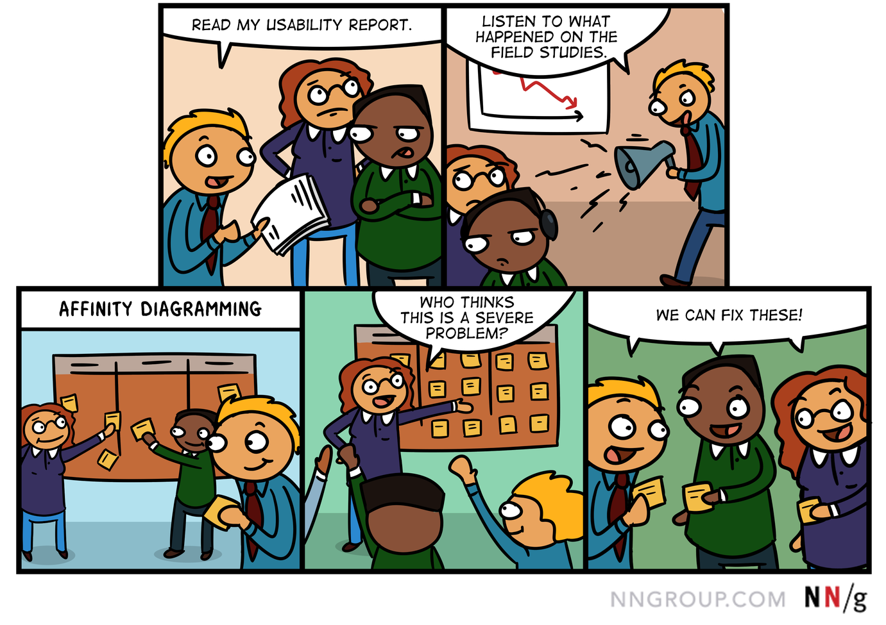
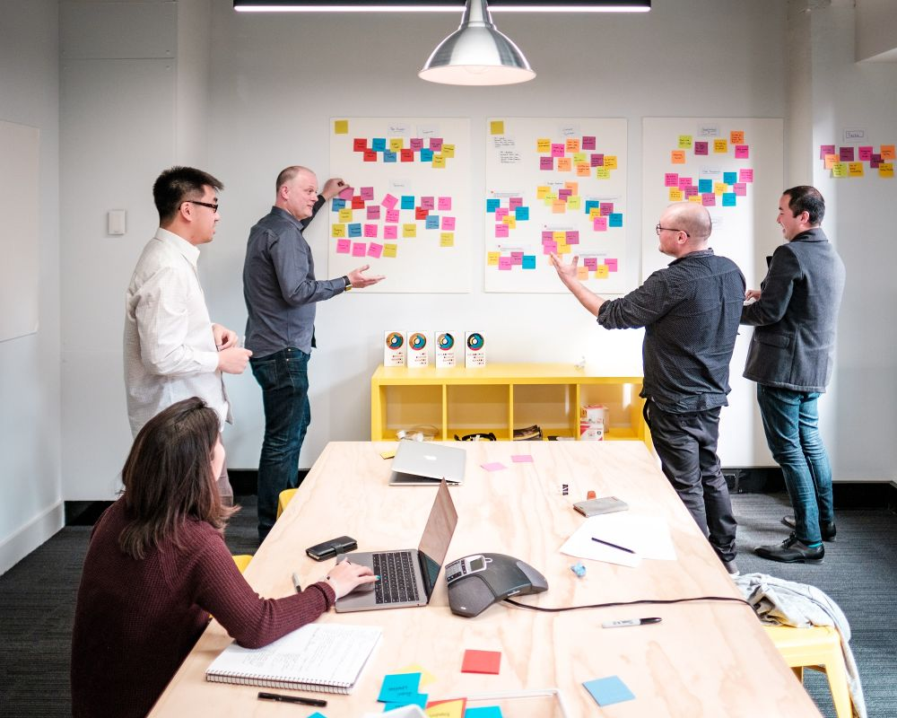
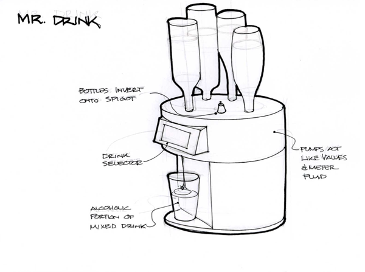
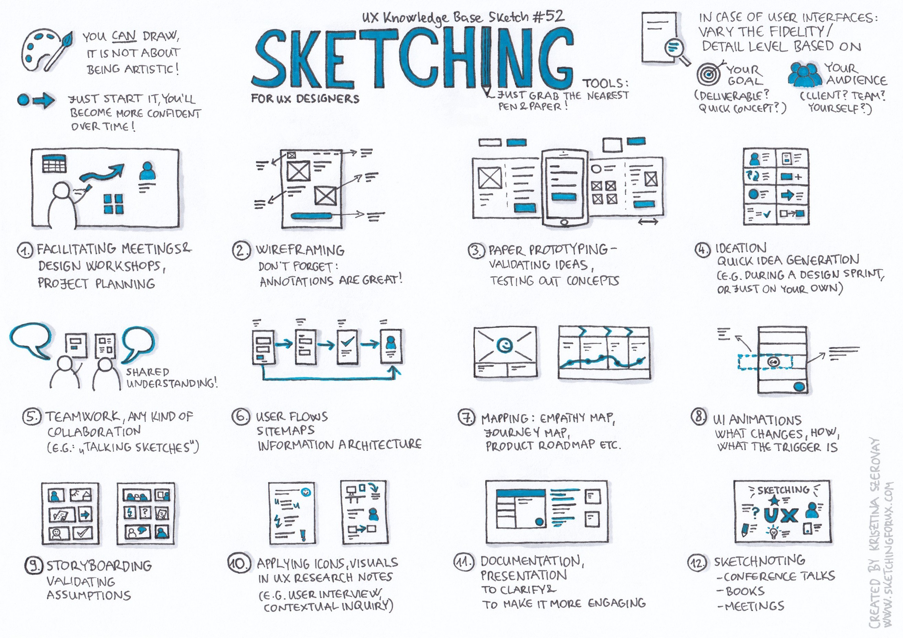
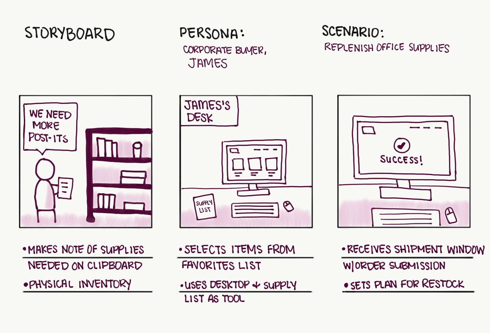
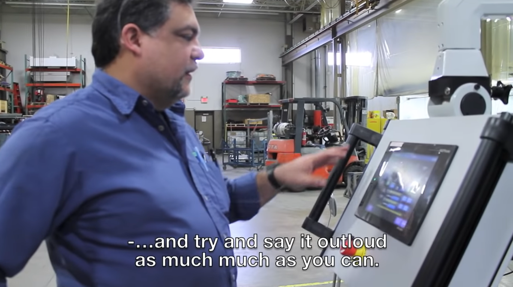
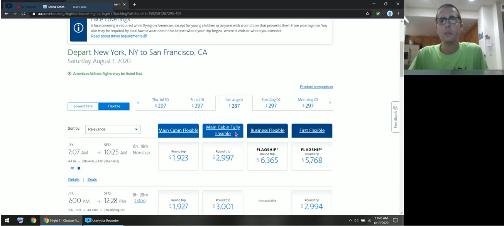
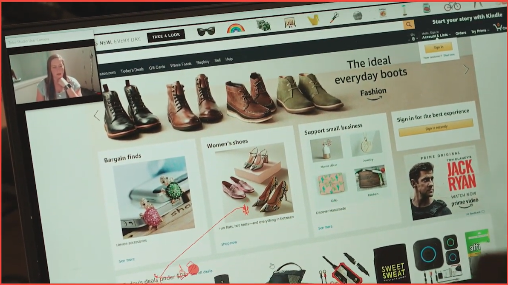

 

# **Design Thinking**
#### CS571: Building User Interfaces

 

#### Cole Nelson

---

# TopHat

What year are you?

---

# cs571.org
All course content will be cross-posted here.
If you are on the waitlist, you can use this instead!

---

# GitHub
Now uses personal access tokens -- **start  the assignment early**!

[More Info](https://docs.github.com/en/authentication/keeping-your-account-and-data-secure/creating-a-personal-access-token)

---

# CS571 "Access" Tokens
Prefaced with "bid_"
Be on the lookout late this/early next week!
**Will not include any links.**
If you are not enrolled but would like one, email me!

---

# TopHat

Did you take this class...

---

## What will we learn today?
 - What is design thinking?
 - How do we empathize with users?
 - How can we turn this empathy into insight?
 - How can we evaluate our designs?

 

---

[NN/g Design Thinking 101](https://www.youtube.com/watch?v=6lmvCqvmjfE)

---

### Design Thinking

1. An **approach**: a hands-on, user-centric approach to innovative problem solving

2. A **process**.

[NN/g Design Thinking](https://www.nngroup.com/articles/design-thinking/)

---

          

[NN/g Design Thinking](https://www.nngroup.com/articles/design-thinking/)

---

# Empathize
Conduct research to develop an understanding of your users.

---

### How do we empathize with users?

Understanding user needs, preferences, and expectations by studying what users do, say, think, and feel.

There are many methods to build empathy: we will explore using **contextual inquiries**.

Others may include: ethnography, diary studies, cultural probes... See CS570!

---

### Conducting a Contextual Inquiry
A contextual inquiry is a method for gathering
and representing data about the user and his/her work.

1. Go where the customer works or lives.
2. Observe the customer as he or she works.
3. Talk to the customer about their work.

---

[Contextual Inquiry: Grocery Shopping](https://www.youtube.com/watch?v=JV6br-npgfw)

---

### Contextual Inquiry Tips

- This is an inquiry, not an interview.
- The client is the master, you are an apprentice.
- Ask questions, but don't distract from the task.
- Focus on the context in which the user acts.

---

---

# Define
Combine all your research and observe where your users' problems exist.

---

### What does that mean?
- Gathering all findings — **gather**
- Consolidating, categorizing, distilling — **analyze**
- Translate into insight — **recommend**

### But how do we go about this?
- Again, there are many methods for analysis.
- The simplest and most powerful method is *affinity diagramming*.

---

### Affinity Diagramming

- **Definition:** Organizing data into clusters based on "affinity."

- It helps you make sense of qualitative, messy data.

- Also known as *affinity mapping*, *collaborative sorting*, *snowballing*.

- Used across the board in creative, generative industries. 

---

          

[NN/g Affinity Diagramming](https://www.nngroup.com/articles/affinity-diagram/)

---

# How do we go about it?*

* **Step 1:** Start with an initial set of categories
* **Step 2:** Sort notes into these categories
* **Step 3:** Add subcategories/consolidate as needed.
* **Step 4:** Present each category
* **Step 5:** Rank categories in _severity_, combining importance, prevalence, frequency

*Alternatively, start with no category names, but group notes by likeness.
After sorting is complete, name these categroies and subcategories.

---

          

[UX Collective](https://uxdesign.cc/8-ux-surefire-ways-to-design-for-trust-7d3720b57a4c) 

---

# In-Class Exercise!
### [Affinity Diagramming](https://docs.google.com/drawings/d/1NfaNzODr05huKWMI6An4kfH_ya-U2y0AzAbGbTT9w24/edit?usp=sharing)

Your findings will serve as _design insight_.

---

---

# Ideate
Generate a range of crazy, creative ideas.

---

### Ideation

**Definition:** An active, creative, exploratory, highly iterative, fast-moving collaborative process for forming ideas for design.

Ideation can be done _individually_ or _collaboratively_.

---

### Key Considerations

* Workspace
* Team
* Process
* Rules of engagement
* Method of capturing ideas

[GlassDoor](https://media.glassdoor.com/l/b5/77/8b/71/ideation-session.jpg)

---

# IDEO's Rules of Engagement

1. Defer judgement.
2. Encourage wild ideas.
3. Build on the ideas of others.
4. Stay focused on the topic.
5. One conversation at a time.
6. Be visual.
7. Go for quantity.

---

# What do we do with ideas?
Sketching. Storyboarding. 

---

Sketching & storyboarding exhibit _conceptual designs_.

# What is Conceptual Design?

**Definition:** An abstract characterization of the context, use, or experience with an envisioned design solution that highlights the main premise of the solution.

---

### Sketching

- Everyone can sketch.
- Sketching is more effective than words for most ideas.
- Quick and inexpensive sketches do not inhibit exploration.
- Sketches are disposable.

[Buxton, 2007](https://www.sciencedirect.com/book/9780123740373/sketching-user-experiences)

---

### Sketching

- Sketches are made just-in-time, in-the-moment, when needed.
- Sketches should be plentiful, entertain a large number of ideas, and include multiple sketches of each idea.
- Textual annotations can explain what is going on in the sketch.

[Buxton, 2007](https://www.sciencedirect.com/book/9780123740373/sketching-user-experiences)

---

          

[Medium](https://miro.medium.com/max/2625/1*BJaaqwORkLiKhzoK06rqsA.jpeg)

---
### Storyboarding

**Definition:** A sequence of visual frames that illustrate user interaction with the envisioned system, capturing social, environmental, and technical factors that shape user experience.

Take your sketches (in context!) and impose them on a storyboard.

---

          

[NN/g: Storyboards Help Visualize UX Ideas](https://www.nngroup.com/articles/storyboards-visualize-ideas/)

---

---

# Prototype
Build real, tactile representations for a range of your ideas. We'll visit this in detail in a future lecture.

Key ideas:

 - scope
 - fidelity
 - interactivity

---

---

# Test
Return to your users for feedback.

---

### Testing Methods

1. **Expert-based** review
2. **User-based** testing

###

Today we'll visit one form of *user-based testing* called a *think-aloud usability test*.

In future lectures, we will explore other methods..

---

### Conducting a Think-Aloud

1. Identify representative users.
2. Ask users to perform representative tasks.
3. Observe and record what they say and do, noting obstacles, pain points, and failures.

###

A think-aloud can be *moderated* or *unmoderated*.

A think-aloud can be done in *field* or in *lab*.

A think-aloud can be done *presently* or *retrospectively*.

---

[Think Aloud: Factory (Moderated, Field, Presently)](https://www.youtube.com/watch?v=-h8hUtwkMCE)

---

[Think Aloud: Airlines (Unmoderated, Lab-ish, Presently)](https://www.youtube.com/watch?v=Fu8q-W6gEWg)

---

[Think Aloud: Tobii (Moderated, Lab, Retrospectively)](https://www.youtube.com/watch?v=rgj7Oi8rCjM)

---

# TopHat

What are the pros/cons of using the Think Aloud Protocol (TAP)?

---

---

# Implement
Put the vision into effect.

---

---

## What did we learn today?

 - What design thinking is.
 - How we can empathize with users.
 - How we can turn this empathy into insight.
 - How we can evaluate our designs.

---

# Next Week
JavaScript Bootcamp!

---

# Questions?