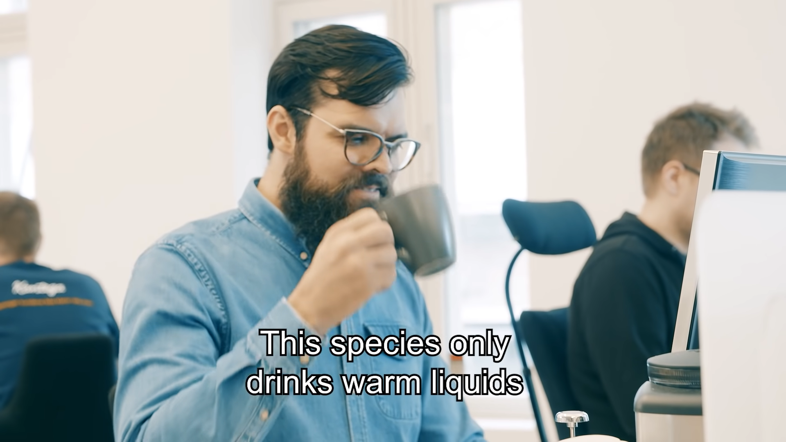
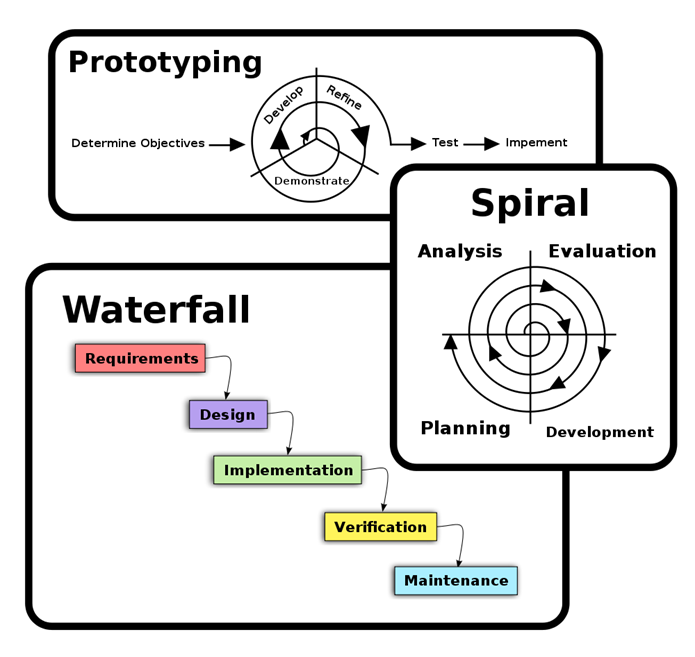
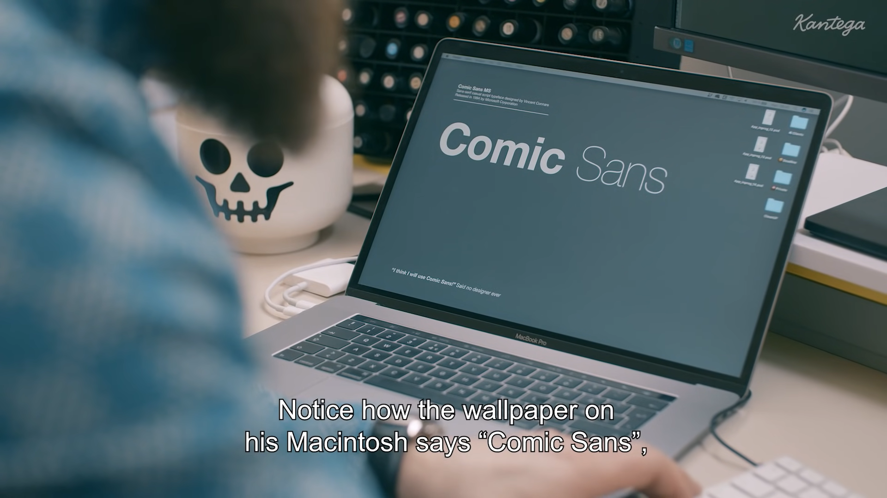
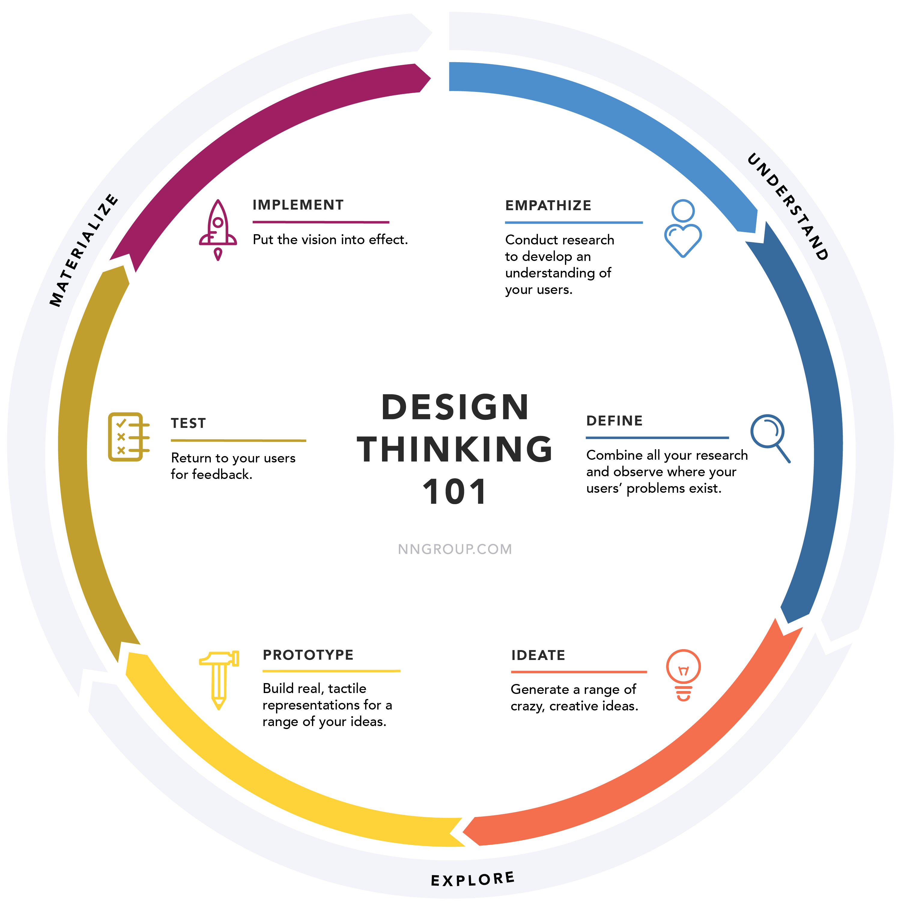
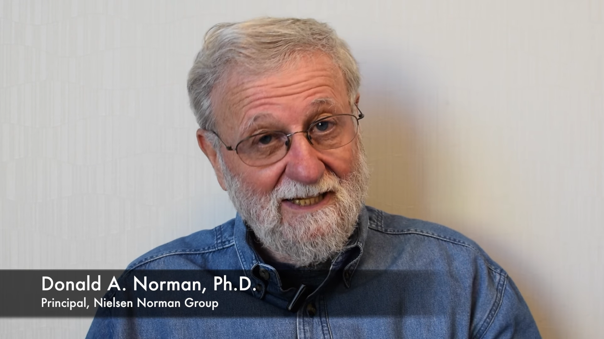
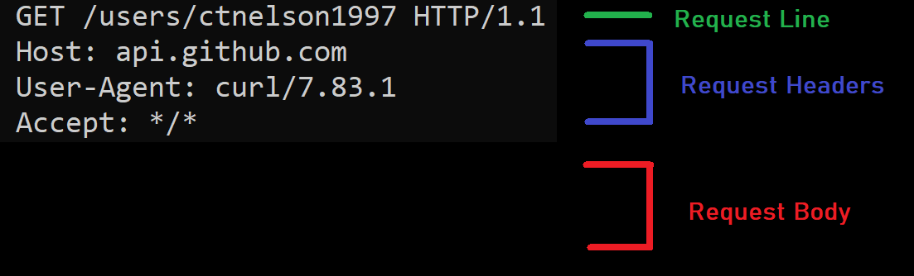
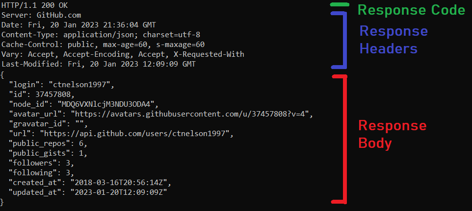
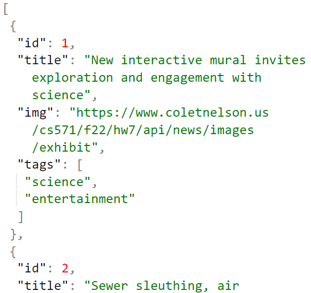
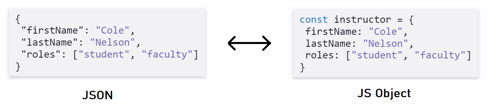

<br>

# **Welcome to CS571!**
## Building User Interfaces


<br>

#### Cole Nelson

---

What is this course about?

<br>

# UX Development

<br>

 ...but what is UX Development?

---


The realm of the UX developer exists <b>somewhere between that of the traditional developer and the designer</b>. We’re not really designers, yet to be a good UX developer you certainly need to have an eye for design. In the same vein, we’re not traditional developers but we certainly need to have development experience and expertise. Often this experience spans multiple technologies, languages, and platforms.

 ###

 — Tim R. Todish


---


It falls on <b>the UX developer to bridge the gap between design and technology</b>. We need to be able to think and speak the language of designers. It’s our job to help translate their vision to the development team in a way that they can understand and accept. This can be a critical piece of the puzzle in a project, especially if the design and the interactions behind it are complex.

###

 — Tim R. Todish


---


Similarly, we need to speak on behalf <b>the developers to help reign in the designers</b>, at times. If they are coming up with concepts that will be extremely difficult or time consuming to implement, we can explain the limitations of the technology and the complexity involved in implementing their designs, and try to come up with an acceptable alternative.


###

 — Tim R. Todish


---

<div class="center-info">

# **UX Development**
## = Software Engineering +
## UX Design

</div>

---

<div class="center-info">

# What does a **Software Engineer** do?

</div>

---
<div class="center-info">


[Kantega | The Mysterious Life of Developers](https://www.youtube.com/watch?v=ocwnns57cYQ)

</div>

---

<b>Definition:</b> A software engineer is a person who applies the principles of software engineering to the design, development, maintenance, testing, and evaluation of computer software.

How does a Software Engineer go about this?


<sub><sup>[What is a Software Engineer?](https://en.wikipedia.org/wiki/Software_engineer)</sup></sub>


---


### Software Development Lifecycle

<sub><sup>[SDL Process](https://en.wikipedia.org/wiki/Software_development_process)</sup></sub>


---

<div class="center-info">

# What does a **UX Designer** do?

</div>

---

<div class="center-info">


[Kantega | The Mysterious Life Of UX Designers](https://www.youtube.com/watch?v=gfHcnig8Lo4)

</div>


---


<b>Definition:</b> User experience (UX) design is the process that design teams use to create products that provide meaningful and relevant experiences to users.  A UX designer is concerned with the entire <i>process</i> of acquiring and integrating a product, including aspects of branding, design, usability, and function.

###

How does a UX designer go about this?

###
<sub><sup>[Interaction Design Foundation](https://www.interaction-design.org/literature/topics/ux-design)</sup></sub>


---


### UX Design Process
Look familiar?

<sub><sup>[NN/g Design Thinking](https://www.nngroup.com/articles/design-thinking/)</sup></sub>


---

# So then, what is **UX Development**?

---

<div class="center-info">



[Don Norman: The term "UX"](https://www.youtube.com/watch?v=9BdtGjoIN4E&t=9s)

</div>

---


<h3>UX Development Trajectories</h3>


 - One-person development team to build full-stack applications
 - A developer who speaks the language of the designers
 - A designer who can also build native prototypes
 - A bridge/translator between designers and developers in large/complex organizations

---

### TopHat Trial
What is your favorite programming language?


---

# Course Details

---


### Cole Nelson
**ctnelson2@wisc.edu**

<div>

Professional Interests
 * Computer Science Education
 * Human-Computer Interaction
 * Web Application Security

###

Personal Interests
 * Coffee

</div>

<br>


---

### Yishen Sun
**yishen.sun@wisc.edu**


<div>

Professional Interests:
 * Distributed Systems
 * Fullstack Development

Personal Interests:
 * Photography
 * Hiking

</div>


---

### Amy Koike
**ekoike@wisc.edu**


<div>

Professional Interests:
 * Human-Robot Interaction
 * Mechanical Design
 * Graphic Design

Personal Interests:
 *  Disney (theme parks, animation, music, everything!)
 * 3D Printers


</div>

---

### Hongtao Hao
**hongtaoh@cs.wisc.edu**


<div>

Professional Interests:
 * Data Visualization

<br/>

Personal Interests:
 * Blogging
 * Meditation
 * Reading

</div>


---

# Who are you?
See HW1.

---

<h3>Course Information</h3>


 - Meet Tuesdays & Thursdays 4:00-5:15p; lectures will be recorded and posted to Kaltura.
 - Tuesday's lecture will cover programming topics, Thursday's lecture will cover fundamental human-computer interaction topics...
   - ... except we will have week-long JavaScript and React "bootcamps" on Weeks 2 and 4.
- Bring a laptop!

---

<style scoped>
table {
  font-size: 20px;
  text-align: left;
}
</style>

<div class="center-info">

| Week   | Topics                                     | Homework    | Quiz    |
|--------|--------------------------------------------|-------------|---------|
| Jan 23 | Intro & Design Thinking                    | Assign HW1  | Quiz A  |
| Jan 30 | JavaScript Bootcamp. JS1 & JS2             | Assign HW2  | Quiz B  |
| Feb 6  | JS3 & Web/Interaction Design               | Assign HW3  | Quiz C  |
| Feb 13 | React Bootcamp. React 1 & React 2          | Assign HW4  | Quiz D  |
| Feb 20 | React 3 & Visual Design                    | Assign HW5  | Quiz E  |
| Feb 27 | React 4 & Expert Evaluation                | Assign HW6  | Quiz F  |
| Mar 6  | React 5 & Midterm                          | No HW       | No Quiz |
| Mar 13 | Spring Break!                              | No HW       | No Quiz |
| Mar 20 | React Native 1 & Mobile Design             | Assign HW7  | Quiz G  |
| Mar 27 | React Native 2 & Design Patterns           | Assign HW8  | Quiz H  |
| Apr 3  | React Native 3 & Prototyping               | Assign HW9  | Quiz I  |
| Apr 10 | React Native 4 & Accessibility             | Assign HW10 | Quiz J  |
| Apr 17 | DialogFlow 1 & VUI Design/Exp. Proto.      | Assign HW11 | Quiz K  |
| Apr 24 | DialogFlow 2 & Agent Design/Usab. Eval.    | Assign HW12 | Quiz L  |
| May 1  | Fullstack Development & Final Exam         | No HW       | No Quiz |
| May 8  | Good luck on your other finals!            | No HW       | No Quiz |

###### Course Schedule

</div>

---

<style scoped>
table {
  font-size: 28px;
  text-align: left;
}
</style>

<div class="center-info">

| Item | Points | Notes |
| - | - | - |
| Weekly Assignments | 52 | 12 HWs, 5 pts each, HWs 1 & 7 only 1 pt. |
| Weekly Quizzes | 11 | 12 quizzes, 1 pt each, lowest dropped |
| Library Usage | 2 | Use of an external dependency. |
| Midterm Exam | 15 | Single-sided notesheet |
| Final Exam | 20 | Double-sided notesheet |

###### Point Distribution

<style scoped>
table {
  font-size: 28px;
  text-align: left;
}
</style>

<div class="center-info">

| A | AB | B | BC | C | D | F
| --- | --- | --- | --- | --- | --- | --- |
| [100, 93] | (93, 88] | (88, 80] | (80, 75] | (75, 70] | (70, 60] | (60, 0]


###### Grading Scale

</div>

---

### TopHat Trial
When should the final exam be held?


---

<div>

<h3>Other Grading Things...</h3>

 - Up to *two* homeworks can be submitted up to one week late without penalty. Homeworks may *not* be submitted more than one week late.
 - Quizzes may *not* be submitted late.
 - Exams will be held *in-person*.
   - Contact me >1 week in advance if you cannot make it - Canvas/HonorLock alternative.
 - Your lowest quiz will be dropped.

</div>


---


### Library Usage

Students must incorporate a meaningful third-party library not dicussed in class and provide a short description about its use. Such third-party libraries could be jquery, typescript, axios, redux, mobx, lodash, or any other meaningful library.

The library can be added to enhance the project *after* the submission date, but it must be completed *before* the final exam. 

---


<h3>Weekly Assignments</h3>

 - Every weekly assignment and quiz is released on Tuesday and due on Monday at 11:59 pm.
 - Submissions may be made up to 1 week late for 50% of the total points earned. Submissions are not accepted later than 1 week.
 - Your first two late assignments will not have points deducted, but cannot be submitted more than 1 week late.

---

<div>

### Academic Integrity
 - **Do not share code with others!**
 - **Do not use code from previous semesters!**
 - You may *discuss* assignments with others, but all work must be done individually.
 - Snippets taken from StackOverflow et. al. must be cited with a comment.
 - We use tools like MOSS... Don't risk it!

---

### Academic Integrity

First Offense
```javascript
let currAssignment = 0;
const newCourseGrade = currCourseGrade * 0.9;
```

Second Offense

```javascript
const newCourseGrade = 0;
fetch('https://conduct.students.wisc.edu/misconduct', {
  method: 'POST',
  body: JSON.stringify(currStudent)
});
```


</div>

---


<h3>Course Tools</h3>


 - Quizzes will be completed via *Canvas*. They are open-book, but must be completed individually.
 - Assignments will be submitted via *GitHub Classroom*.
 - Questions will be asked via *Piazza*.
 - Personal matters will be handled via *email*.

---

<div>

<h3>Tools & Downloads</h3>

 - **Visual Studio Code** for JS Development
 - **Node 18 and NPM 8** for React Development
 - **Postman** for API Exploration
 - **Git** for Version Control/Submission

</div>

---

### McBurney & Accommodations

The University of Wisconsin-Madison supports the right of all enrolled students to a full and equal educational opportunity.

Please inform me of your need for instructional accommodations during the beginning of the semester, or as soon as possible after being approved for accommodations.

---

### Mental Health

UHS offers no-cost services in psychiatry, individual, couple, and group counseling, alcohol and drug abuse, and other mental health needs.

Schedule an access appointment at 608-265-5600 option 2 or contact 24/7 crisis support at option 9.

You matter!

---

# Today's Topic
The Web.

---

### Web Communication


<br/>
<br/>
<br/>
<br/>
<br/>
<br/>
<br/>

<sub><sup>[Medium](https://medium.com/@rohitpatil97/http-request-http-response-context-and-headers-part-iii-5c37bd4cb06b)</sup></sub>

---

### A Web Frontend

HTTP does delivery for a bakery that makes cake!

| Aspect | Behavior | Cake |
| - | - | - |
| HTML | Structure | Sponge |
| CSS | Design | Icing |
| JS | Behavior | Clown |

---

### How does my browser get information?
Via APIs! e.g. we can imagine that

https://github.com/ctnelson1997 gets information from
https://api.github.com/users/ctnelson1997

---



---



---

### Why JSON?

<div>

 - easy to understand
 - human-readable
 - language agnostic
 - easily convertible to JS objects

 </div>

 

---

### JSON to JS Object

<br>



---

# HW1 & GitHub Classroom
Expressing yourself in JSON.

---

# Questions?
