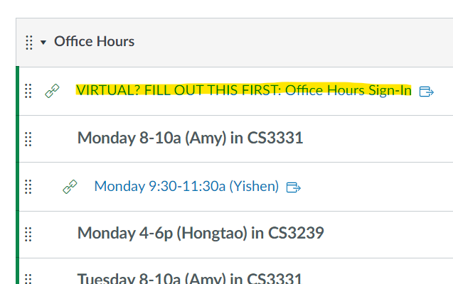
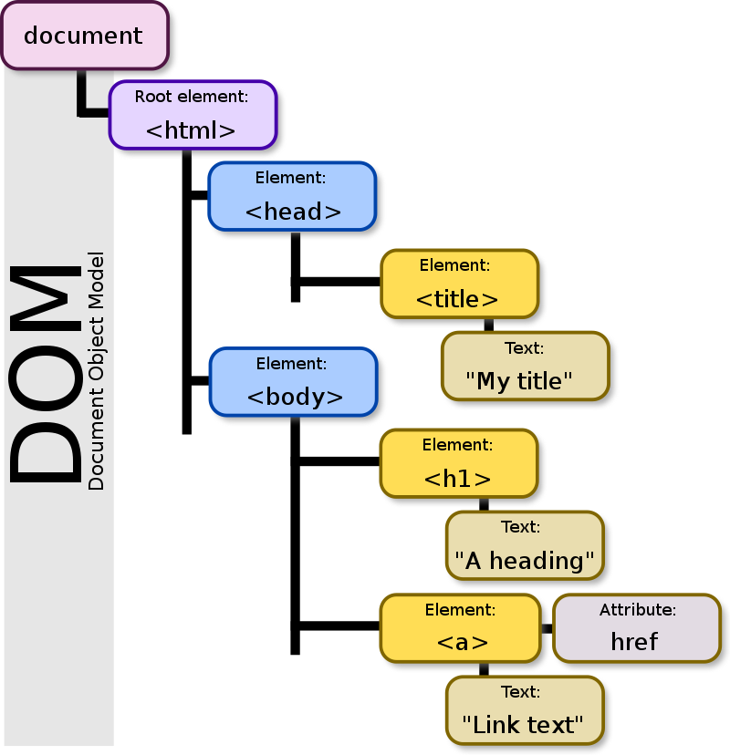
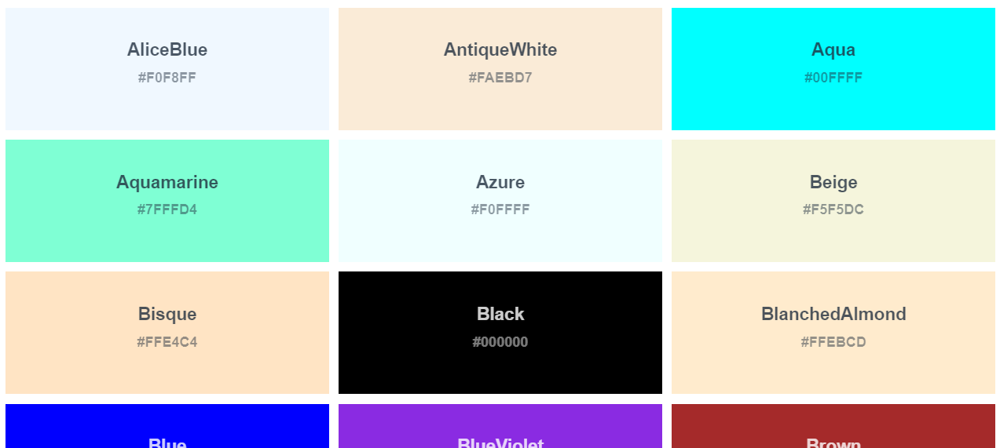
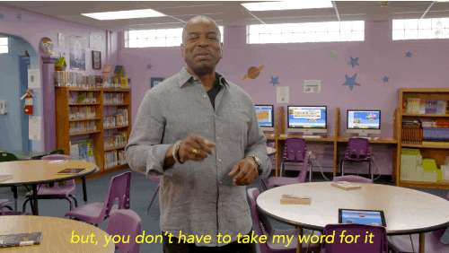

<br>

# **JavaScript 1**
With Hints of HTML and CSS...

###

#### CS571: Building User Interfaces


<br>

#### Cole Nelson

---

### Office Hours

Starting this week.

Virtual? Fill out the Google Form first.



---

### Learning Objectives

1. Obtain a broad understanding of web programming.
2. Understand the essentials of JavaScript.
3. Be able to use JavaScript in web programming.
4. Know of other popular tools.

---

### Web Programming

This is not a comprehensive introduction to web programming, so these are great additional resources:

<div>

 - [MDN Web Docs](https://developer.mozilla.org/en-US/docs/Web/JavaScript)
 - [W3 Schools](https://www.w3schools.com/js/)

</div>

###

Periodically, we will also use [StackBlitz](https://stackblitz.com/) or [CodePen](https://codepen.io/) for code snippets.

---

### Web Communication


<br/>
<br/>
<br/>
<br/>
<br/>
<br/>
<br/>

<sub><sup>[Medium](https://medium.com/@rohitpatil97/http-request-http-response-context-and-headers-part-iii-5c37bd4cb06b)</sup></sub>

---

### A Web Frontend

HTTP does delivery for a bakery that makes cake!

| Aspect | Behavior | Cake |
| - | - | - |
| HTML | Structure | Sponge |
| CSS | Design | Icing |
| JS | Behavior | Clown |

---

### HTML

Hyper-Text Markup Language

Defines the structure of the webpage.

Made up of a series of "elements" (sometimes referred to as "nodes") defined by "tags".

```html
<h1>Hello world!</h1>
<div>
  <p>My favorite foods are...</p>
</div>
```

---

### HTML

Each element can have 0-to-many attributes defined as key-value pairs in its tag.

Each element can have a unique `id` attribute - useful for CSS and JS!

```html
<h1 id="intro-txt" style="font-size: 99">Hello world!</h1>
<p>Visit my <a href="http://example.com/">other website</a></p>

```

---

### HTML

Notice the structure?

We call this the Document Object Model (DOM).

This will be very useful later!




---

### HTML

Tags we should know...

 - `html`: encapsulate entire html document
 - `head`: include metadata, such as CSS and JS scripts
 - `body`: main HTML content

```html
<html lang="en">
    <head></head>
    <body>
      <p>My HTML would go here...</p>
    </body>
</html>
```

---

### HTML

Tags we should know...

 - `h1` through `h6`: headers
 - `p` paragraph text
 - `strong` and `em` (instead of `b` and `i`): connotation
 - `a`: anchor text (links)
 - `img`: images (always include an `alt` attribute!)


---

### HTML

Tags we should know...

<div>

 - `br`: linebreak
 - `ul`, `ol`, `li`: lists
 - `table`, `thead`, `tbody`, `tr`, `th`, `td`: tables
 - `div`: divisions (sections)

</div>


---

### HTML

Tags we should know...

<div>

 - `form`: encapsulates many inputs
 - `label`: label an input (always include a `for` attribute)
 - `input`: user input
 - `button`: buttons

</div>

---

# Badger Bowling
Just HTML

---

### CSS
Cascading Style Sheets

Defines the styles to be used.

Uses a cascading hierarchy of selectors and decoration boxes consisting of key-value pairs.

```css
p {
  color: blue;
  font-size: 16px; /* prefer em or rem; e.g. 1rem */
}
```

---

### CSS

` ` applies to all HTML elements with a particular tag.

`#` applies to all HTML elements with a particular id.

`.` applies to all HTML elements with a particular class.

You can mix and match these!

You can decorate many elements with comma-seperated lists!

---

### CSS

| Example | Description |
| --- | --- |
| #firstname | Selects the element with id="firstname" |
| .intro | Selects all elements with class="intro" |
| p.intro	 | Selects  `<p>` elements with class="intro" |
| * | Selects all elements |
| p | Selects all `<p>` elements |
| div, p | Selects all `<div>` and `<p>` elements |

<sup><sub>[W3Schools](https://www.w3schools.com/css/css_selectors.asp)</sub></sup>

---

### TopHat
What will the following CSS do?

```css
.center {
  text-align: center;
}
```


---

### Many, many, many colors! [See W3](https://www.w3schools.com/cssref/css_colors.php)



---

### CSS

There are three ways to include your own css...

<div>

1. Inline
2. Internal
3. External

</div>

###

When doing CSS, prefer external over inline!

---

### CSS Inline

```html
<div style="background-color: powderblue">
  <h1 style="font-size: 4rem">Badger</h1>
  <ul>
    <li style="background-color: orange">a heavily built omnivorous nocturnal mammal</li>
    <li style="color: red">of the weasel family</li>
    <li>typically having a gray and black coat.</li>
  </ul>
  <p style="text-align: right">From the <strong>Oxford</strong> dictionary</p>
</div>
```

[StackBlitz](https://stackblitz.com/edit/web-platform-rszwvq)

---

### CSS Internal

```html
<style>
  #main-div {
    background-color: green;
    margin: 1rem;
  }
  li {
    color: yellow;
    font-size: 1.25rem;
  }
  .right-text {
    text-align: right;
  }
</style>
```

[StackBlitz](https://stackblitz.com/edit/web-platform-yf1bfx)

---

### CSS External

Same as internal but with styling in an external file, e.g. `styles.css`. Include stylesheet in HTML with...

```html
<link rel="stylesheet" href="styles.css"/>
```

[StackBlitz](https://stackblitz.com/edit/web-platform-setjm1)

---

### CSS Cascading

1. Author inline styles
2. Author embedded styles (aka: internal style sheets)
3. Author external style sheet
4. User style sheet
5. Default browser style sheet

<sub><sup>[Simmons](https://web.simmons.edu/~grabiner/comm244/weekfour/css-concepts.html)</sup></sub>

---

### CSS Misc Notes

Browsers have evolved! Not all browsers support all CSS (same goes for HTML and JS)!

It may take some trial and error to figure out the right CSS attribute(s)!

Use browser developer tools!

`!important` is dangerous!

---

# Badger Bowling
Just HTML and CSS

---

### JavaScript History

 - Developed by Netscape Communications (Brendan Eich) in 1995. 
   - It was designed in 10 days.
 - A "glue language" for HTML.
 - Mocha > LiveScript > JavaScript.
 - Specifications are ECMAScript (e.g. "ES").

---


### Try It!

Browser > F12 > Console




---


### Variables

JS is a dynamic, loosely-typed language. The data type is inferred from the declaration and can be changed.

Variables are *containers* that hold data.

There are 7 standard data types: numbers, string, boolean, null, undefined, symbol, object. The first 6 are considered *primitive* and are stored on the *stack*. Object is considered *complex* and stored on the *heap*.

---

### Variable Declarations

Variables can be declared with `var`, `let`, or `const`.

| Keyword | Scope | Re-assignable? | Preferred? |
| - | - | - | - |
| var | function | yes | no |
| let | block | yes | yes |
| const | block | no | yes |

`let` and `const` were introduced in ES6. They are the preferred ways of declaring a variable.


---


### Variable Examples

Consider the following block of code...

```javascript
let age = 27;
const name = "Ashley";
var hasCar = false;
```

Can we perform `age = 28`? Yes! We use `let`.

Can we perform `name = "Carl"`? No! We use `const`.

Is `hasCar` declared correctly? Yes, but we should use `let` instead of `var`.


---


### Variable Examples

Is this block of code correct?

```javascript
let name = "Ahmed";
console.log("My name is " + name);
name = 27;
console.log("My age is " + name);
name += 1;
console.log("My age a year later is " + name);
```

It's not *good* code, but it is *correct* code! Variables can change types during runtime.


---


### Determining Data Types 

We can query the data type at runtime using `typeof`.

```javascript
let foo = "Charles";
console.log(typeof foo);
foo = 1932;
console.log(typeof foo);
foo = true;
console.log(typeof foo);
```

```
string
number
boolean
```


---


### Conditionals
Conditionals allow the code to make decisions and carry out different actions.

###

**Three types:**
1. `if`, `else if`, and `else` statements
2. `switch` statements
3. ternary operators `evalExpr ? trueExpr : falseExpr`


---


### Conditionals
Any value that is not `false`, `undefined`, `null`, `0`, `NaN`, or `""` returns `true`. Why is this useful?

```javascript
var currentMember = "Alice";
let textContent = "?";
if (currentMember) {
  textContent = "View Profile";
} else {
  textContent = "Sign Up";
}
console.log(textContent)
```

```
'View Profile'
```

---


### Comparison and Logical Operators

| Operator | Meaning |
| - | - |
| === and !== | strong comparison |
| == and != | weak comparison |
| < and > | less/greater than |
| <= and => | less/greater than or equal to |
| && | and |
| \|\| | or |


---


### Objects

Objects are unordered collections of data defined using key-value pairs. These are sometimes referred to as "attributes" or "properties".

```javascript
let teachingAssistant = {
   firstName: "Alice",
   lastName: "Smith",
   age: 24
};
console.log(teachingAssistant);
```

```
{firstName: 'Alice', lastName: 'Smith', age: 24}
```


---


### Object Properties
There are two different notations to access object properties.

```javascript
console.log(teachingAssistant.lastName);
console.log(teachingAssistant["firstName"]);
```
```
'Smith'
'Alice'
```


---


### Arrays
An array is a variable that contains multiple elements.

```javascript
let fruits = ["apple", "banana", "coconut"];
fruits[0] = "apricot";
console.log(fruits);
fruits.push(17);
console.log(fruits);
```

```
['apricot', 'banana', 'coconut']
['apricot', 'banana', 'coconut', 17]
```

**Notice!** They don't have to be the same type.


---


### Looping

For Loops
```javascript
for (let i = 0; i < 10; i++) {}  // typical for loop
for (let attr in course) {}      // loop through object properties
for (let item of arr) {}         // loop through array contents
```

While Loops
```javascript
while(cond) {}                   // typical while loop
do {} while(cond);               // guarantees atleast one execution
```

You can use `break` (exit) and `continue` (skip).


---


### Functions

A procedure that includes a set of statements that performs a task or calculates a value.

```javascript
function fToC(temp) {
  return (temp - 32) * 5/9;
}
fToC(77)
```
```
25
```


---


### Other Ways to Declare Functions

Function Expression

```javascript
const fToC = function(temp) {
  return (temp - 32) * 5/9;
}
```

Arrow Function

```javascript
const fToC = (temp) => {
  return (temp - 32) * 5/9;
}
```

---

# Your turn!

Write a JavaScript function that takes an array of numbers and computes their sum, e.g.

```
[1, 3.2, -4.0, 5] => 5.2
```

... can you do it as a function, function expression, and arrow function?

**Protip:** Write your code in notepad and paste it into your browser's developer console to test!

---

### Banned Words

Let's try to avoid these at all costs...

`var`: strange scoping

`this`: strange scoping

`==`: strange comparison


---

# JavaScript and the Web

---


<div>

### JavaScript and the Web

Just like CSS, we can include JavaScript...

1. Inline JS
2. Internal JS
3. External JS

</div>

###


---

### Inline JavaScript
The JavaScript is included inside of the HTML element.

<sub><sup>index.html</sup></sub>
```html
<html>
  <h1>Welcome to my webpage!</h1>
  <button onclick="console.log('hello world!')">Click Me!</button>
</html>
```


---

### Internal JavaScript
The JavaScript is included inside of the HTML.

<sub><sup>index.html</sup></sub>
```html
<html>
  <h1>Welcome to my webpage!</h1>
  <script>
    console.log("hello world!");
  </script>
</html>
```

---

### External JavaScript
The JavaScript is included from outside of the HTML.

<sub><sup>index.html</sup></sub>
```html
<html>
  <h1>Welcome to my webpage!</h1>
  <script src='app.js'></script>
</html>
```

<sub><sup>app.js</sup></sub>
```javascript
console.log("hello world!");
```


---


### Document Object Model (DOM)
HTML is just a tree, where each element is a node!

We use JavaScript to manipulate this tree.

<sub><sup>[Document Object Model](https://en.wikipedia.org/wiki/Document_Object_Model#/media/File:DOM-model.svg)</sup></sub>


---


### Manipulating the DOM

Use `document` to reference the DOM.

```javascript
let title = document.getElementById("articleTitle");
let loginBtn = document.getElementsByName("login")[0];
let callouts = document.getElementsByClassName("callout"); // *
```

<sub><sup>*class refers to a **CSS** class</sup></sub>


We can add *event listeners* or read/modify *properties*.

[StackBlitz](https://stackblitz.com/edit/web-platform-e6zusx)


---


### Manipulating the DOM
Using these DOM elements, we can change the title of the article, add an action for when the button is clicked, and make all of the callouts red.

 </div>

```javascript
title.textContent = 'My Website!';
loginBtn.addEventListener("click", () => {
  alert("You are advancing to the next part of the site...");
});

for (let callout of callouts) {
  callout.style.color = "red";
}
```

[StackBlitz](https://stackblitz.com/edit/web-platform-e6zusx)


---

# Badger Bowling
Using HTML, CSS, and JS!

---

# Other Tools

---

### What is this "TypeScript" I hear about?

TypeScript (TS) is a strict syntactical superset of JS developed to enable the development of large-scale applications and to add static typing.

A preprocessor is used to transpile TS to JS.

#### Safety of Java + Flexibility of JS = TS

We do not cover TS in this course.

---

### What is this "jQuery" I hear about?

A fast, small, and feature-rich JavaScript library.

Contains all of the functions that you wish were in the standard JavaScript library.
 - **jQuery**: `$("#login")`
 - **DOM**: `document.getElementById('login')`

<sub><sup>[Keep your jQuery up-to-date!](https://security.snyk.io/package/npm/jquery)</sup></sub>


We do not cover jQuery in this course.

---

### What is this "Bootstrap" I hear about?

A CSS Framework for developing responsive and mobile-first websites.

We *will* cover this *soon* :)

---

# Questions?