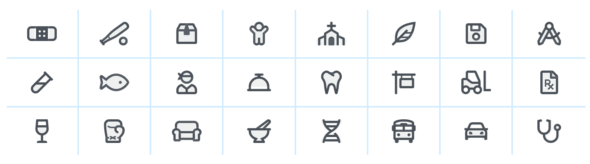

<br>

# **JavaScript 2**
### CS571: Building User Interfaces


<br>

#### Cole Nelson

---

### What we will learn today?

<div>

* How to work with APIs and JSON data
* How to write async functions
* How to write declaratively

</div>

---

### What is JSON?
**Definition:** JavaScript Object Notation (JSON) is a structured way to represent text-based data based on JS object syntax.

---

### Refresher: JS Objects
**Definition:** Objects are unordered collection of related data of primitive or reference types defined using key-value pairs.

```javascript
const instructor = {
  firstName: "Cole",
  lastName: "Nelson",
  roles: ["student", "faculty"]
}
```

---
### JSON Equivalent

```json
{
  "firstName": "Cole",
  "lastName": "Nelson",
  "roles": ["student", "faculty"]
}
```

**What's the difference?** A JS Object is executable code; JSON is a language-agnostic representation of an object. There are also slight differences in syntax.

---

You can write comments in JS Objects...
```javascript
const drinks = [
  {
    name: "Mimosa",
    ingredients: [
      {name: "Orange Juice", hasAlcohol: false},
      {name: "Champagne", hasAlcohol: true}
    ]
  },
  {
    name: "Vesper Martini", // shaken, not stirred
    ingredients: [
      {name: "Gin", hasAlcohol: true},
      {name: "Vodka", hasAlcohol: true},
      {name: "Dry Vermouth", hasAlcohol: true},
    ]
  }
]
```

---

... but not in JSON!
```json
[
  {
    "name": "Mimosa",
    "ingredients": [
      { "name": "Orange Juice", "hasAlcohol": false },
      { "name": "Champagne", "hasAlcohol": true }
    ]
  },
  {
    "name": "Vesper Martini",
    "ingredients": [
      { "name": "Gin", "hasAlcohol": true },
      { "name": "Vodka", "hasAlcohol": true },
      { "name": "Dry Vermouth", "hasAlcohol": true }
    ]
  }
]
```

---

### Conversion
Because JS Objects and JSON are so similar, it is easy to convert between them.

<div>

 - `JSON.parse` JSON String → JS Object
 - `JSON.stringify` JS Object → JSON string

</div>

---

### Conversion Examples
Using `JSON.parse` and `JSON.stringify`.

```javascript
const myObj = JSON.parse('{"name": "Cole", "age": 24}');
const myStr = JSON.stringify(myObj);

console.log(typeof myObj);
console.log(typeof myStr);
```

```
object
string
```

---

### What is an API?
**Definition:** An application programming interface (API) is a set of definitions and protocols for communication through the serialization and de-serialization of objects.

JSON is a language-agnostic medium that we can serialize to and de-serialize from!

---

### How do we make an API request?

<div>

 - Your browser!
 - [cURL](https://curl.se/)
 - [Postman](https://www.postman.com/)
 - JavaScript

</div>

###

Try making an API request to...

<div>

 - https://v2.jokeapi.dev/joke/Any?safe-mode
 - https://cs571.org/s23/week2/api/cole 

</div>

---

### Request for JSON

- Requests can be `synchronous` or `asynchronous`. 
- `asynchronous` requests are recommended as they are *non-blocking*. Typically, they use a *callback* when the data is received and lets the browser continue its work while the request is made.

<sub><sup>More on [synchronous/asynchronous requests](https://developer.mozilla.org/en-US/docs/Web/API/XMLHttpRequest/Synchronous_and_Asynchronous_Requests)</sup></sub>

---

### Making Asynchronous HTTP Requests

Two key methods: `XMLHttpRequest` (old) and `fetch` (new). `fetch` is a promise-based method. 

- `Promise` objects represent the eventual completion/failure of an *asynchronous* operation and its resulting value. 
- `async` / `await` — keywords to indicate that a function is *asynchronous* -- will learn later!


---

### `fetch()`

```javascript
fetch(url)
  .then((response) => response.json())
  .then((data) => {
    // Implictly parses JSON to JS object
    // Do something with the data
  })
  .catch(error => console.error(error)) // Print errors
```

[Fetching Jokes](https://stackblitz.com/edit/js-7qag38?file=index.html,index.js)

---

### `fetch()` from a CS571 API

```javascript
fetch(url, {
  method: "GET",
  headers: {
    "X-CS571-ID": "bid_zzzzzzzzzzzzzzzzzzzz"
  }
})
.then(response => response.json())
.then(data => {
  // Do something with the data
})
.catch(error => console.error(error)) // Print errors
```

There is a database that maps your BID to a WISC ID!

---

### Your Turn!

Fetch data from our API and do "interesting" things!

`https://cs571.org/s23/week2/api/cole`

 1. Can you get *any* data back?
 2. Can you dynamically put my name on the HTML?
 3. What are my favorite colors?
 4. What semesters did I take more than 15 credits?
 5. Which of my plants survived?

---

### Callback Functions

`then` and `catch` take a *callback function* as an argument.

**Definition:** A *callback function* (sometimes called a *function reference*) is passed into another function as an argument, which is then invoked inside the outer function to complete a routine or action.


<sub><sup>More on [callback functions](https://developer.mozilla.org/en-US/docs/Glossary/Callback_function)</sup></sub>

---

### Callback Functions

```javascript
function greeting1(name) {
  alert('Hello ' + name);
}

const greeting2 = (name) => {
  alert('Whats up ' + name);
}

function processUserInput(callback) {
  const name = prompt('Please enter your name.');
  callback(name);
}

processUserInput(greeting1);
processUserInput(greeting2);
processUserInput((name) => alert("Welcome " + name));
```

---

# Declarative vs. Imperative
Writing "clean code".

---

### Declarative vs Imperative Programming

The following is imperative...

`for (let obj of arr) { /* stmts */ }`

###

The following is declarative...

`arr.forEach((obj) => { /* stmts */ })`

###

We typically prefer *declarative* programming over *imperative* programming.

---

### Declarative vs Imperative Programming

Declarative array functions include `forEach`, `map`, `slice`, `concat`, `filter`, `some`, `every`, and `reduce`.

###

Today we'll learn about `forEach` and `filter`!

Eventually, we'll learn how to use these!


---

### `forEach` and `filter`

Both are used on *arrays*.

Both take a callback as an argument.

This callback takes an argument* representing the current element, e.g.

```javascript
students.forEach((student) => /* */);
grades.filter((grade) => /* */);
```

<sub><sup>* also an *optional* second arg of index `grades.filter((grade, i) => /* */)` </sup></sub>

---

### Declarative vs Imperative Programming

Imperatively, to list the favorite colors...

```javascript
console.log("Favorite colors...");
data.favColors.forEach(color => console.log(color));
```

---

### Declarative vs Imperative Programming

`forEach` can be used on an array...

```javascript
console.log("Favorite colors...");
data.favColors.forEach(color => console.log(color));
```

---


---

### Declarative vs Imperative Programming

Imperatively, to get the number of semesters with more than 15 credits...

```javascript
// assume semesterData is the array of semester history from the API
let moreThan15Creds = [];
for (const sem of semesterData) {
    if(sem.cred > 15) {
        moreThan15Creds.push(sem.semester);
    }
}
console.log("Semesters with more than 15 credits...");
console.log(moreThan15Creds);
```

---

### Declarative vs Imperative Programming

Declaratively, we could simply write...

```javascript
const moreThan15Creds = data.creditHistory.filter(sem => {
  if (sem.cred > 15) {
    return true;
  } else {
    return false;
  }
});

console.log("Semesters with more than 15 credits...");
console.log(moreThan15Creds);
```

---

### Declarative vs Imperative Programming

More concisely...

```javascript
const moreThan15Creds = data.creditHistory.filter(sem => {
  return sem.cred > 15;
});

console.log("Semesters with more than 15 credits...");
console.log(moreThan15Creds);
```

---

### Declarative vs Imperative Programming

Even more concisely...

```javascript
const moreThan15Creds = data.creditHistory.filter(sem => sem.cred > 15);

console.log("Semesters with more than 15 credits...");
console.log(moreThan15Creds);
```

---

### Other `async` Functions

 - `setInterval(callback, interval)` perform a callback function every interval milliseconds.*
 - `setTimeout(callback, timeout)` perform a callback function in timeout milliseconds.*

[Fetch Jokes (w/ `setInterval`)](https://stackblitz.com/edit/js-wfgh3j?file=index.html,index.js)

[Fetch Jokes (w/ `setInterval` and `setTimeout`)](https://stackblitz.com/edit/js-1g42b8?file=index.html,index.js)

<sub><sup>\* approximately</sup></sub>

---

### Data Copying
`json.parse` and `json.stringify` can also be useful for deep data copying.^


<sub><sup>^ [lodash](https://lodash.com/) is the preferred way to copy.</sup></sub>


---

### Data Copying

Sometimes we wish to make copies of data, e.g. we want to duplicate an array of student objects.

<div>

1. Reference Copy
2. Shallow Copy
3. Deep Copy

</div>

######

**Recall:** Variables are containers -- they contain a primitive value or a *pointer* to an object.

---

### Reference Copy

What will the output be?

```javascript
let myBasket = {
  basketId: 154,
  items: ["Apples", "Bananas", "Grapes"]
};
let myRefCopyBasket = myBasket; // *
myRefCopyBasket.basketId = 999;
myRefCopyBasket.items.push("Zucchinis");

console.log(myBasket);
console.log(myRefCopyBasket);
```

[Interactive Exercise](https://pythontutor.com/visualize.html#code=let%20myBasket%20%3D%20%7B%0A%20%20basketId%3A%20154,%0A%20%20items%3A%20%5B%22Apples%22,%20%22Bananas%22,%20%22Grapes%22%5D%0A%7D%3B%0Alet%20myRefCopyBasket%20%3D%20myBasket%3B%20//%20*%0AmyRefCopyBasket.basketId%20%3D%20999%3B%0AmyRefCopyBasket.items.push%28%22Zucchinis%22%29%3B%0A%0Aconsole.log%28myBasket%29%3B%0Aconsole.log%28myRefCopyBasket%29%3B&cumulative=false&curInstr=0&heapPrimitives=nevernest&mode=display&origin=opt-frontend.js&py=js&rawInputLstJSON=%5B%5D&textReferences=false)

---

### Reference Copy

```javascript
let myBasket = {
  basketId: 154,
  items: ["Apples", "Bananas", "Grapes"]
};
let myRefCopyBasket = myBasket; // *
myRefCopyBasket.basketId = 999;
myRefCopyBasket.items.push("Zucchinis");

console.log(myBasket);
console.log(myRefCopyBasket);
```

```
{basketId: 999, items: ['Apples', 'Bananas', 'Grapes', 'Zucchinis']}
{basketId: 999, items: ['Apples', 'Bananas', 'Grapes', 'Zucchinis']}
```

---

### Shallow Copy

What will the output be?

```javascript
let myBasket = {
  basketId: 154,
  items: ["Apples", "Bananas", "Grapes"]
};
let myShallowCopyBasket = {...myBasket}; // *
myShallowCopyBasket.basketId = 999;
myShallowCopyBasket.items.push("Zucchinis");

console.log(myBasket);
console.log(myShallowCopyBasket);
```

[Interactive Exercise](https://pythontutor.com/visualize.html#code=let%20myBasket%20%3D%20%7B%0A%20%20basketId%3A%20154,%0A%20%20items%3A%20%5B%22Apples%22,%20%22Bananas%22,%20%22Grapes%22%5D%0A%7D%3B%0Alet%20myShallowCopyBasket%20%3D%20Object.assign%28%7B%7D,%20myBasket%29%3B%20//%20%7B...%7D%20is%20ES2018%20syntax%0AmyShallowCopyBasket.basketId%20%3D%20999%3B%0AmyShallowCopyBasket.items.push%28%22Zucchinis%22%29%3B%0A%0Aconsole.log%28myBasket%29%3B%0Aconsole.log%28myShallowCopyBasket%29%3B&cumulative=false&curInstr=0&heapPrimitives=nevernest&mode=display&origin=opt-frontend.js&py=js&rawInputLstJSON=%5B%5D&textReferences=false)

---

### Shallow Copy

```javascript
let myBasket = {
  basketId: 154,
  items: ["Apples", "Bananas", "Grapes"]
};
let myShallowCopyBasket = {...myBasket}; // *
myShallowCopyBasket.basketId = 999;
myShallowCopyBasket.items.push("Zucchinis");

console.log(myShallowCopyBasket);
console.log(myRefCopyBasket);
```

```
{basketId: 154, items: ['Apples', 'Bananas', 'Grapes', 'Zucchinis']}
{basketId: 999, items: ['Apples', 'Bananas', 'Grapes', 'Zucchinis']}
```

---

### Deep Copy

What will the output be?

```javascript
let myBasket = {
  basketId: 154,
  items: ["Apples", "Bananas", "Grapes"]
};
let myDeepCopyBasket = JSON.parse(JSON.stringify(myBasket)); // *
myDeepCopyBasket.basketId = 999;
myDeepCopyBasket.items.push("Zucchinis");

console.log(myBasket);
console.log(myDeepCopyBasket);
```

[Interactive Exercise](https://pythontutor.com/visualize.html#code=let%20myBasket%20%3D%20%7B%0A%20%20basketId%3A%20154,%0A%20%20items%3A%20%5B%22Apples%22,%20%22Bananas%22,%20%22Grapes%22%5D%0A%7D%3B%0Alet%20myDeepCopyBasket%20%3D%20JSON.parse%28JSON.stringify%28myBasket%29%29%3B%20//%20*%0AmyDeepCopyBasket.basketId%20%3D%20999%3B%0AmyDeepCopyBasket.items.push%28%22Zucchinis%22%29%3B%0A%0Aconsole.log%28myBasket%29%3B%0Aconsole.log%28myDeepCopyBasket%29%3B&cumulative=false&curInstr=0&heapPrimitives=nevernest&mode=display&origin=opt-frontend.js&py=js&rawInputLstJSON=%5B%5D&textReferences=false)

---

### Deep Copy

```javascript
let myBasket = {
  basketId: 154,
  items: ["Apples", "Bananas", "Grapes"]
};
let myDeepCopyBasket = JSON.parse(JSON.stringify(myBasket)); // *
myDeepCopyBasket.basketId = 999;
myDeepCopyBasket.items.push("Zucchinis");

console.log(myBasket);
console.log(myDeepCopyBasket);
```

```
{basketId: 154, items: ['Apples', 'Bananas', 'Grapes']}
{basketId: 999, items: ['Apples', 'Bananas', 'Grapes', 'Zucchinis']}
```

---

# Working with CSS Libraries

---

### What are CSS Libraries?

**Definition:** Software libraries that abstract away the low-level CSS implementation of user-facing elements.

Some popular libraries include...
<div>

* [Bootstrap](https://getbootstrap.com/)
* [Foundation](https://foundation.zurb.com/)
* [Semantic UI](https://semantic-ui.com/)
* [Pure](https://purecss.io/)
* [UIkit](https://getuikit.com/v2/)

</div>

---

## Bootstrap


[getbootstrap.com](https://getbootstrap.com/)

---

## How Bootstrap Works

Bootstrap provides us with...

<div>

* Layouts
* Content
* Components
* Utilities

</div>

###

There is much more!

---

#### Responsive Design
**Definition:** Responsive design adapts content to a variety of devices and screen sizes.

Width breakpoints determine whether the design will scale or be reorganized.


<sub><sup>[InVision](https://s3.amazonaws.com/www-assets.invisionapp.com/uploads/2018/10/INV_Responsive_Image_One_L1R1.png)</sup></sub>

---

### Bootstrap Categories: **Layouts**

<div>

**Containers** are the most basic element of layouts.

```html
<div class="container">
  ...
</div>
```

```html
<div class="container-fluid">
  ...
</div>
```

```html
<div class="container-{breakpoint}"> <!-- xs, sm, md, lg, xl-->
  ...
</div>
```

</div>

---

### Containing a Grid

Basic usage of a grid...

```html
<div class="container">
  <div class="row">
    <div class="col-*-^"></div>
    <div class="col-*-^"></div>
  </div>
</div>
```

Where `*` is *grid class* and `^` is *column size*.

You can specify multiple of these classes to make your website responsive to phone, tablet, and desktop!

---


---

### Bootstrap Categories: **Content**

Content styling includes basic HTML elements, typography, code, images, tables, figures.

Basic HTML examples:

```html
<h1></h1>
<ul></ul>
<input/>
<button></button>
```

These will get the default Bootstrap styling.

---

### Styling of other elements

```html

```

```html
<table class="table">
  <thead class="thead-dark">
    <tr>
      <th scope="col">...</th>
      ...
```

```html
<div class="table-responsive-sm">
  <table class="table">
  ...
```

---

### Bootstrap Categories: **Components**

Components include all other visual/interactive elements that make up the design, e.g., buttons, forms, navbar, tooltips, etc. 

```html
<button type="button" class="btn btn-primary">Fill button</button>

<button type="button" class="btn btn-outline-primary">Outline button</button>

<div class="btn-group-toggle" data-toggle="buttons">
  <label class="btn btn-secondary active">
    <input type="checkbox" checked autocomplete="off"> Switch
  </label>
</div>
```

---

### Bootstrap Categories: **Utilities**

Utilities are not elements themselves, but they modify/control other elements, e.g., adding rounded corners to an image.

```html

```

```html
<div class="shadow p-3 mb-5 bg-white rounded">Shadow</div>
```

---

# Example Home Page
[See in CodePen](https://codepen.io/yuhangz/pen/jOwazjv?editors=1111)

---

### Additional Resources

<div>

* [Bootstrap Documentation](https://getbootstrap.com/docs/4.3/getting-started/introduction/)
* [Tutorial Republic](https://www.tutorialrepublic.com/twitter-bootstrap-tutorial/)
* [W3 Schools](https://www.w3schools.com/bootstrap/default.asp)

</div>

---

### Assets
Asset libraries, e.g., icons, are usually used in conjunction with frameworks such as Bootstrap.



See [icon libraries](https://getbootstrap.com/docs/4.3/extend/icons/).

<sub><sup>[Image Source](https://fontawesome.com/)</sup></sub>


---

<div>

### What did we learn today?

* Working with JSON data
* Working with APIs
* Working with other async functions
* Working with Bootstrap and CSS libraries

</div>

---

# On to Prototyping! 🚀