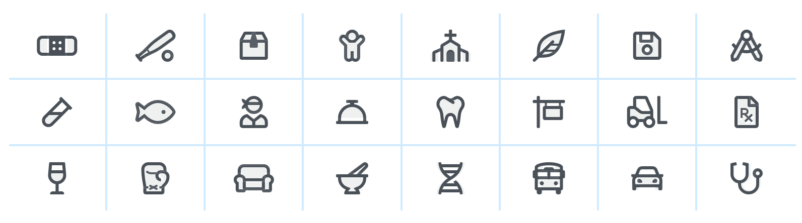

<br>

# **JavaScript 3**
### CS571: Building User Interfaces


<br>

#### Cole Nelson

---

### JavaScript 2 Recap

---

### What will we learn today?
 - things

---

# Working with CSS Libraries

---

### What are CSS Libraries?

**Definition:** Software libraries that abstract away the low-level CSS implementation of user-facing elements.

Some popular libraries include...
<div>

* [Bootstrap](https://getbootstrap.com/)
* [Foundation](https://foundation.zurb.com/)
* [Semantic UI](https://semantic-ui.com/)
* [Pure](https://purecss.io/)
* [UIkit](https://getuikit.com/v2/)

</div>

---

## Bootstrap


[getbootstrap.com](https://getbootstrap.com/)

---

## How Bootstrap Works

Bootstrap provides us with...

<div>

* Layouts
* Content
* Components
* Utilities

</div>

###

There is much more!

---

#### Responsive Design
**Definition:** Responsive design adapts content to a variety of devices and screen sizes.

Width breakpoints determine whether the design will scale or be reorganized.


<sub><sup>[InVision](https://s3.amazonaws.com/www-assets.invisionapp.com/uploads/2018/10/INV_Responsive_Image_One_L1R1.png)</sup></sub>

---

### Bootstrap Categories: **Layouts**

<div>

**Containers** are the most basic element of layouts.

```html
<div class="container">
  ...
</div>
```

```html
<div class="container-fluid">
  ...
</div>
```

```html
<div class="container-{breakpoint}"> <!-- xs, sm, md, lg, xl-->
  ...
</div>
```

</div>

---

### Containing a Grid

Basic usage of a grid...

```html
<div class="container">
  <div class="row">
    <div class="col-*-^"></div>
    <div class="col-*-^"></div>
  </div>
</div>
```

Where `*` is *grid class* and `^` is *column size*.

You can specify multiple of these classes to make your website responsive to phone, tablet, and desktop!

---


---

### Bootstrap Categories: **Content**

Content styling includes basic HTML elements, typography, code, images, tables, figures.

Basic HTML examples:

```html
<h1></h1>
<ul></ul>
<input/>
<button></button>
```

These will get the default Bootstrap styling.

---

### Styling of other elements

```html

```

```html
<table class="table">
  <thead class="thead-dark">
    <tr>
      <th scope="col">...</th>
      ...
```

```html
<div class="table-responsive-sm">
  <table class="table">
  ...
```

---

### Bootstrap Categories: **Components**

Components include all other visual/interactive elements that make up the design, e.g., buttons, forms, navbar, tooltips, etc. 

```html
<button type="button" class="btn btn-primary">Fill button</button>

<button type="button" class="btn btn-outline-primary">Outline button</button>

<div class="btn-group-toggle" data-toggle="buttons">
  <label class="btn btn-secondary active">
    <input type="checkbox" checked autocomplete="off"> Switch
  </label>
</div>
```

---

### Bootstrap Categories: **Utilities**

Utilities are not elements themselves, but they modify/control other elements, e.g., adding rounded corners to an image.

```html

```

```html
<div class="shadow p-3 mb-5 bg-white rounded">Shadow</div>
```

---

# Example Home Page
[See in CodePen](https://codepen.io/yuhangz/pen/jOwazjv?editors=1111)

---

### Additional Resources

<div>

* [Bootstrap Documentation](https://getbootstrap.com/docs/4.3/getting-started/introduction/)
* [Tutorial Republic](https://www.tutorialrepublic.com/twitter-bootstrap-tutorial/)
* [W3 Schools](https://www.w3schools.com/bootstrap/default.asp)

</div>

---

### Assets
Asset libraries, e.g., icons, are usually used in conjunction with frameworks such as Bootstrap.



See [icon libraries](https://getbootstrap.com/docs/4.3/extend/icons/).

<sub><sup>[Image Source](https://fontawesome.com/)</sup></sub>


---

### Data Copying
`json.parse` and `json.stringify` can also be useful for deep data copying.^


<sub><sup>^ [lodash](https://lodash.com/) is the preferred way to copy.</sup></sub>


---

### Data Copying

Sometimes we wish to make copies of data, e.g. we want to duplicate an array of student objects.

<div>

1. Reference Copy
2. Shallow Copy
3. Deep Copy

</div>

######

**Recall:** Variables are containers -- they contain a primitive value or a *pointer* to an object.

---

### Reference Copy

What will the output be?

```javascript
let myBasket = {
  basketId: 154,
  items: ["Apples", "Bananas", "Grapes"]
};
let myRefCopyBasket = myBasket; // *
myRefCopyBasket.basketId = 999;
myRefCopyBasket.items.push("Zucchinis");

console.log(myBasket);
console.log(myRefCopyBasket);
```

[Interactive Exercise](https://pythontutor.com/visualize.html#code=let%20myBasket%20%3D%20%7B%0A%20%20basketId%3A%20154,%0A%20%20items%3A%20%5B%22Apples%22,%20%22Bananas%22,%20%22Grapes%22%5D%0A%7D%3B%0Alet%20myRefCopyBasket%20%3D%20myBasket%3B%20//%20*%0AmyRefCopyBasket.basketId%20%3D%20999%3B%0AmyRefCopyBasket.items.push%28%22Zucchinis%22%29%3B%0A%0Aconsole.log%28myBasket%29%3B%0Aconsole.log%28myRefCopyBasket%29%3B&cumulative=false&curInstr=0&heapPrimitives=nevernest&mode=display&origin=opt-frontend.js&py=js&rawInputLstJSON=%5B%5D&textReferences=false)

---

### Reference Copy

```javascript
let myBasket = {
  basketId: 154,
  items: ["Apples", "Bananas", "Grapes"]
};
let myRefCopyBasket = myBasket; // *
myRefCopyBasket.basketId = 999;
myRefCopyBasket.items.push("Zucchinis");

console.log(myBasket);
console.log(myRefCopyBasket);
```

```
{basketId: 999, items: ['Apples', 'Bananas', 'Grapes', 'Zucchinis']}
{basketId: 999, items: ['Apples', 'Bananas', 'Grapes', 'Zucchinis']}
```

---

### Shallow Copy

What will the output be?

```javascript
let myBasket = {
  basketId: 154,
  items: ["Apples", "Bananas", "Grapes"]
};
let myShallowCopyBasket = {...myBasket}; // *
myShallowCopyBasket.basketId = 999;
myShallowCopyBasket.items.push("Zucchinis");

console.log(myBasket);
console.log(myShallowCopyBasket);
```

[Interactive Exercise](https://pythontutor.com/visualize.html#code=let%20myBasket%20%3D%20%7B%0A%20%20basketId%3A%20154,%0A%20%20items%3A%20%5B%22Apples%22,%20%22Bananas%22,%20%22Grapes%22%5D%0A%7D%3B%0Alet%20myShallowCopyBasket%20%3D%20Object.assign%28%7B%7D,%20myBasket%29%3B%20//%20%7B...%7D%20is%20ES2018%20syntax%0AmyShallowCopyBasket.basketId%20%3D%20999%3B%0AmyShallowCopyBasket.items.push%28%22Zucchinis%22%29%3B%0A%0Aconsole.log%28myBasket%29%3B%0Aconsole.log%28myShallowCopyBasket%29%3B&cumulative=false&curInstr=0&heapPrimitives=nevernest&mode=display&origin=opt-frontend.js&py=js&rawInputLstJSON=%5B%5D&textReferences=false)

---

### Shallow Copy

```javascript
let myBasket = {
  basketId: 154,
  items: ["Apples", "Bananas", "Grapes"]
};
let myShallowCopyBasket = {...myBasket}; // *
myShallowCopyBasket.basketId = 999;
myShallowCopyBasket.items.push("Zucchinis");

console.log(myShallowCopyBasket);
console.log(myRefCopyBasket);
```

```
{basketId: 154, items: ['Apples', 'Bananas', 'Grapes', 'Zucchinis']}
{basketId: 999, items: ['Apples', 'Bananas', 'Grapes', 'Zucchinis']}
```

---

### Deep Copy

What will the output be?

```javascript
let myBasket = {
  basketId: 154,
  items: ["Apples", "Bananas", "Grapes"]
};
let myDeepCopyBasket = JSON.parse(JSON.stringify(myBasket)); // *
myDeepCopyBasket.basketId = 999;
myDeepCopyBasket.items.push("Zucchinis");

console.log(myBasket);
console.log(myDeepCopyBasket);
```

[Interactive Exercise](https://pythontutor.com/visualize.html#code=let%20myBasket%20%3D%20%7B%0A%20%20basketId%3A%20154,%0A%20%20items%3A%20%5B%22Apples%22,%20%22Bananas%22,%20%22Grapes%22%5D%0A%7D%3B%0Alet%20myDeepCopyBasket%20%3D%20JSON.parse%28JSON.stringify%28myBasket%29%29%3B%20//%20*%0AmyDeepCopyBasket.basketId%20%3D%20999%3B%0AmyDeepCopyBasket.items.push%28%22Zucchinis%22%29%3B%0A%0Aconsole.log%28myBasket%29%3B%0Aconsole.log%28myDeepCopyBasket%29%3B&cumulative=false&curInstr=0&heapPrimitives=nevernest&mode=display&origin=opt-frontend.js&py=js&rawInputLstJSON=%5B%5D&textReferences=false)

---

### Deep Copy

```javascript
let myBasket = {
  basketId: 154,
  items: ["Apples", "Bananas", "Grapes"]
};
let myDeepCopyBasket = JSON.parse(JSON.stringify(myBasket)); // *
myDeepCopyBasket.basketId = 999;
myDeepCopyBasket.items.push("Zucchinis");

console.log(myBasket);
console.log(myDeepCopyBasket);
```

```
{basketId: 154, items: ['Apples', 'Bananas', 'Grapes']}
{basketId: 999, items: ['Apples', 'Bananas', 'Grapes', 'Zucchinis']}
```

---