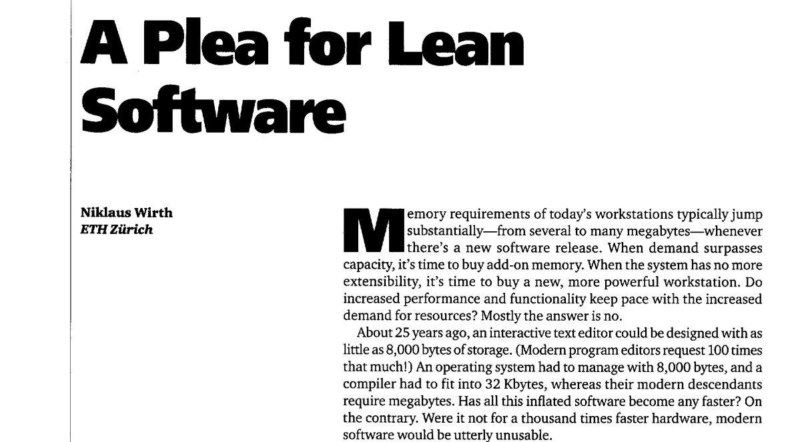
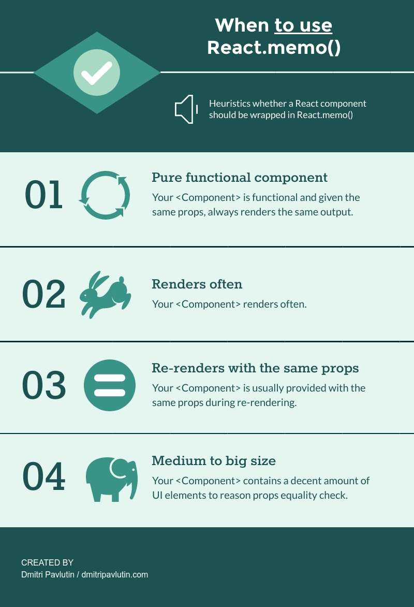
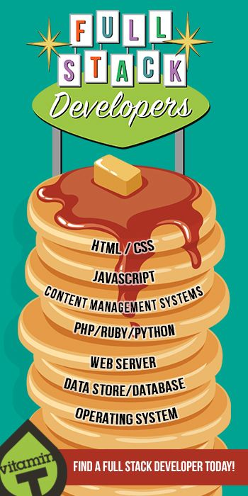
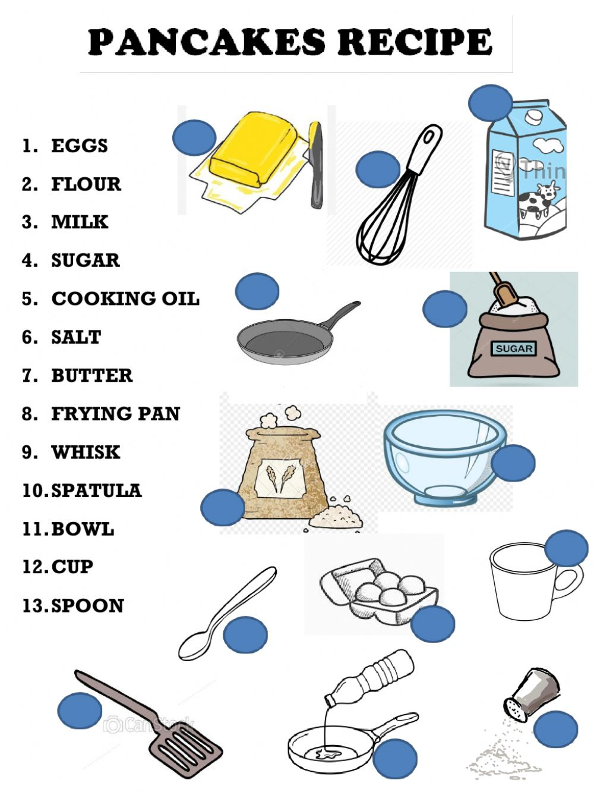
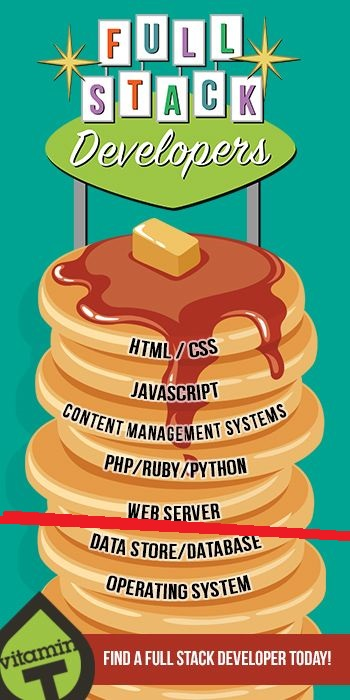
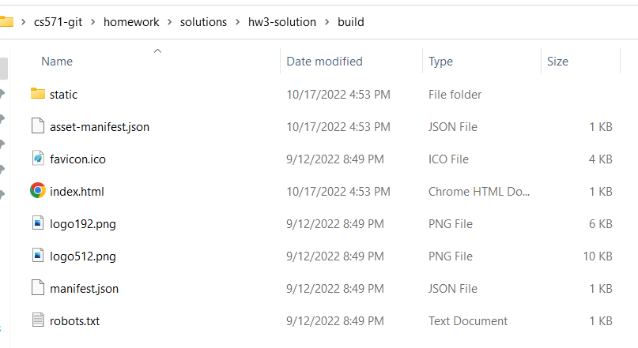

<br>

# **React 5**
### CS571: Building User Interfaces


<br>

#### Cole Nelson

---

### Logistics

 - Cole's Office Hours will be on Wednesday, 9a-12p this week (on Zoom)!
 - Midterm exam coming up...
   - Short review of F22 solution at end of class!
 - Please fill out [the AEFIS Survey](https://aefis.wisc.edu/) by March 10th!

---

### Midterm Exam

 - Thursday, March 9th 5:45-7:15pm in the Chemistry Building Room S429. You will have **75 minutes** for 24 MC (8 pts), 5 SA (5 pts), and 1 LR (2 pts)
   - Be conscious of your use of time!
 - **Single-sided** standard sheet of paper for notes.
   - Handwritten or typed is okay!
 - Bring your Wiscard and a pencil!
 - F22 midterm and solution on Canvas.

---

# Memoization
Not memorization!

---

### Memoization

Storing the result so you can use it next time instead of calculating the same thing again and again

[what the frik is: memoization](https://whatthefuck.is/memoization)

###

`useCallback` to memoize functions
`useMemo` to memoize calculated values
`memo` to memoize components

---

### `useCallback` Hook

Consider the following functional component...

```javascript
function MyApp() {
  const myComplicatedFunction = () => {
    // ...
  }

  return <>
    <button onClick={myComplicatedFunction}>Click Me</button>
  </>
}
```

How many times do we *create* the function `myComplicatedFunction`? We do on *every render*!

---

### `useCallback` Hook

`useCallback` is used to ['memoize'](https://whatthefuck.is/memoization) a callback function.

```javascript
function MyApp() {
  const myComplicatedFunction = useCallback(() => {
    // ...
  }, []);

  return <>
    <button onClick={myComplicatedFunction}>Click Me</button>
  </>
}
```

Takes a callback function to 'memoize' and an optional list of dependencies (e.g. when to re-'memoize').

---

### `useMemo` Hook

Same thing as `useCallback`, except memoizes the *value* of a *callback* rather than the *callback* itself.

```javascript
function MyApp() {
  const myComplicatedValue = useMemo(() => { /* Some complex call */}, []);

  return <>
    <p>{myComplicatedValue}</p>
  </>
}
```

---

### `memo`-ized Components

Used for creating *purely functional* components. Given the same props, the function renders the same output.

```javascript
//                  v--- Name of functional component!
export default memo(GroceryList, (prevProps, nextProps) => {
  return prevProps.apples === nextProps.apples &&
    prevProps.bananas === nextProps.bananas &&
    prevProps.coconuts === nextProps.coconuts;
})
```

[See StackBlitz](https://stackblitz.com/edit/react-9nbqzn) for `useCallback`, `useMemo`, and `memo`

---


---



---

### Finding a Balance

1. Given the same input, renders the same output.
2. Is rendered often.
3. Does not change often.
4. Is of substantial size.

[Dmitri Pavlutin Blog Post](https://dmitripavlutin.com/use-react-memo-wisely/)



---

### Your turn!

Expand on our ticket tracking app from last week...

 1. Replace "ENTER_YOUR_BID" with your Badger ID.
 2. Don't allow the user to post a message if it contains a bad word like "frik".
 3. Memoize! Use `useCallback`, `useMemo`, and `memo`

[Clone from here.](https://github.com/CS571-S23/week07-react5-inclass-example)

---

### What will we learn today?

<div>

 - How are legacy React apps made?
 - How can we write re-usable logic?
 - What is the bigger picture for React Apps?
 - Preparing for React Native...

</div>

---

### Legacy React Apps

Legacy React apps were class-based and had "lifecycle methods". We won't go into any more detail.

```javascript
class Welcome extends React.Component {
  constructor(props) {
    super(props);
    this.state = { counter: 0 };
    this.handleClick = this.handleClick.bind(this);
  }
  componentDidMount() { /* ... */ }
  handleClick() { /* ... */ }
  render() {
    return <h1>Hello World!</h1>;
  }
}
```

---

# How Can We Reuse Logic?
Practicing **D**on't **R**epeat **Y**ourself (DRY)

---

### Custom React Hooks

You can write your own custom hooks! These are just JavaScript functions that can use React's features!

 - We use **custom components** to re-use **UI elements**.
 - We use **custom hooks** to re-use **business logic**.

[JSConf Talk](https://www.youtube.com/watch?v=J-g9ZJha8FE)

---

# Let's Write a Custom Hook!
Writing reusable logic for persisting data.

<br>

[StackBlitz Solution](https://stackblitz.com/edit/react-yxigdl) | [Inspitation from WDS](https://blog.webdevsimplified.com/2019-11/how-to-write-custom-hooks/)

---

# Congrats!
You are now a React Devloper! 🥳🎊🎉

---

### Questions You Should Ask Yourself...
- What even is "frontend development"?
- Where does this fit in to the software stack?
- How can I get my web app out in front of customers?
- What concerns should I have about my web app?
- What else can I do with these skills?
- How much of a raise should I ask for? 💰

---

### Software Stack



Think of software like a stack of pancakes...

[Image Source](https://www.pinterest.com/pin/looking-for-a-full-stack-developer-weve-got-you-covered--456693218441395202/)

---

### Software Stack


... where each pancake can be its own flavor...

[Image Source](https://cookingwithmammac.com/flavored-pancakes/)

---

### Software Stack

... and can be cooked its own way...



[Image Source](https://www.liveworksheets.com/worksheets/en/English_as_a_Second_Language_(ESL)/Recipes/Lets_make_pancakes_ty1088539hd)

---

### Software Stack

... with as many or as few as we want!


[Image Source](https://www.goodhousekeeping.com/uk/food/a552834/this-stack-of-pancakes-has-2500-calories/)

---

### Software Stack

We typically refer to the "frontend" as the content that gets delivered to the user...


[Image Source](https://www.pinterest.com/pin/looking-for-a-full-stack-developer-weve-got-you-covered--456693218441395202/)

---

### Software Stack

...but this can change based on your perspective!



[Image Source](https://www.pinterest.com/pin/looking-for-a-full-stack-developer-weve-got-you-covered--456693218441395202/)

---

### The Browser


However, we are constrained to what the browser can interpret...

<div>

 - HTML
 - CSS
 - JS

</div>

---

# So... is React an Exception?
Facebook is influential, but not *that* influential!

---

### Reminder: JSX

This React component displays Hello World on the webpage using JSX.

```javascript
function Welcome() {
  return <h1>Hello World!</h1>;
}
```

[Babel](https://babeljs.io/) transpiles JSX into JS, CSS, and HTML.

---

### Delivery of React App
We don't deliver our JSX code, we deliver HTML, CSS, and JS generated via `npm run build`!

Also, specify a home page (absolute or relative)...

```json
{
  "name": "hw3",
  "version": "0.1.0",
  "private": true,
  "homepage": "https://coletnelson.us/mycoolapp/",
  "dependencies": {
    ...
  }
}
```

---

# What does this do?
Creates our "build bundle"...

---



---

```html
<html lang="en">
  <head>
    <meta charset="utf-8" />
    <link rel="icon" href="./favicon.ico" />
    <meta name="viewport" content="width=device-width,initial-scale=1" />
    <meta name="theme-color" content="#000000" />
    <meta name="description" content="Web site created using create-react-app" />
    <link rel="apple-touch-icon" href="./logo192.png" />
    <link rel="manifest" href="./manifest.json" />
    <title>React App</title>
    <script defer="defer" src="./static/js/main.aae268c3.js"></script>
    <link href="./static/css/main.ace4cd11.css" rel="stylesheet">
  </head>
  <body><noscript>You need to enable JavaScript to run this app.</noscript>
    <div id="root"></div>
  </body>
</html>
```

---


---

### Build Bundle Deployment

<br><br><br><br><br><br><br><br>


---

### Concerns in Production...

<div>

 - Reliability
 - Performance
 - Monitoring
 - Business Value of Delivery
 - Search Engine Optimization (SEO)

</div>

---

### Reliability

Does our code work?

<div>

- Manual testing
- Automated testing
  - [Jest](https://jestjs.io/)
  - [React Testing Library](https://testing-library.com/docs/react-testing-library/intro/)
- Static analysis
  - [TypeScript](https://www.typescriptlang.org/): Used for type-checking
  - [ESLint](https://eslint.org/): Used for following best practice

</div>

---

### Performance

Does our code work *well*?

<div>

 - Be aware of the "bundle size"!
 - Our code specifically...
   - [Perf](https://reactjs.org/docs/perf.html)
   - [Profiler](https://reactjs.org/blog/2018/09/10/introducing-the-react-profiler.html)
 - Our code broadly...
   - [Google Lighthouse](https://developer.chrome.com/docs/lighthouse/overview/)
   - [Chrome User Experience Report (CrUX)](https://developer.chrome.com/docs/crux/)

</div>

---

### Monitoring

Does our code *continue to* work well?

<div>

 - Logging
   - *Not* `console.log`
   - [Sentry](https://sentry.io/welcome/)
   - [DataDog](https://www.datadoghq.com/)
 - Cloud Tools
   - Cloud Monitoring Tools
   - [DownDetector](https://downdetector.com/)

</div>

---

### Business Value of Delivery

<div>

 - Core Questions
   - Are we making money? 💸
   - Are users making use of new features?
 - Analysis Methods
   - [A/B Testing](https://vwo.com/ab-testing/)
   - [Customer Surveys](https://www.helpscout.com/blog/customer-survey/)
 - Commercial Tools
   - [Pendo](https://www.pendo.io/)

<div>

---

### Search Engine Optimization (SEO)
The generated HTML simply says...
```
You need to enable JavaScript to run this app.
```
What is a search engine crawler supposed to do?

**Option:** Server Side Rendering [next.js](https://nextjs.org/)

---

# Your Considerations?

---

# Up Next: React Native
[React Native in 100 seconds](https://www.youtube.com/watch?v=gvkqT_Uoahw)

---

# F22 Midterm Review
Questions? Gotchas? 

---

### What did we learn today?

<div>

 - How are legacy React apps made?
 - How can we write re-usable logic?
 - What is the bigger picture for React Apps?
 - Preparing for React Native...

</div>

---

### Quick Reminder

Students must incorporate at least one additional, meaningful third-party library into at least one of their submissions and provide a short description about its use. **Please submit the seperate Canvas assignment.**

You may go *back* and use a library!

---

### Quick Reminder

Please complete the [AEFIS Mid-Semester Survey](https://aefis.wisc.edu/) by March 10th! 🙂

This is optional and not required but encouraged!

Feel free submit the Canvas assignment acknowledging that you *can* (but don't have to) complete it.


---

# Questions?