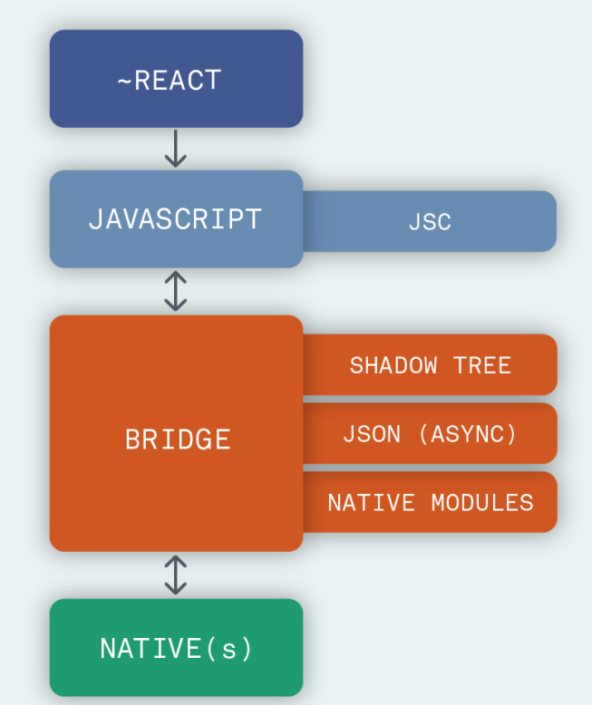
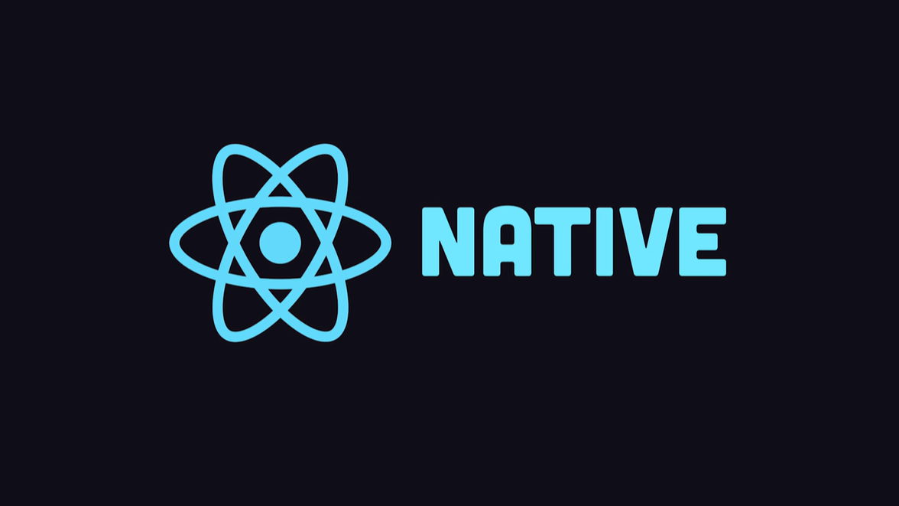

<br>

# **React Native 1**
### CS571: Building User Interfaces


<br>

#### Cole Nelson

---

### Download Expo

 - Download for [iOS](https://apps.apple.com/us/app/expo-go/id982107779)
 - Download for [Android](https://play.google.com/store/apps/details?id=host.exp.exponent&hl=en_US&gl=US)
 - Don't have a smart phone? You can use an emulator like [AVD](https://developer.android.com/studio/run/managing-avds) or [XCode](https://developer.apple.com/xcode/)


---

### Mid-Semester Feedback

**40% response rate!** 🥳 Can we get 60% for the final evaluation? Takeaways...

 **1. Go slower.**
 2. More time for examples.
 3. Get lecture notes out earlier -- I'll try!
 4. More seats -> two sections of CS571 in F23

---

### Midterm Exam

1. Great job!
2. Scores will be released in the next two weeks.
2. Final Exam will be 40 multiple-choice worth 20 pts over 90 minutes with a double-sided notesheet.
3. Free bonus +0.5 points for rounding error.

---

# Midterm Exam Review
[See Canvas](https://canvas.wisc.edu/courses/345833/files/31491560?module_item_id=5979570)

---

### What will we learn today?

<div>

 - What is mobile development?
 - How does React Native fit into mobile development?
 - Programming w/ React Native & Expo

</div>

---

# Mobile Development
Native Development and its Alternatives

---

### What is "True Native" Development?

Building specifically for the device (e.g. Android or iOS) that you want to support.

**iOS**: Objective-C or Swift w/ Cocoapods
**Android**: Java or Kotlin w/ Maven or Gradle

---

### Pros and Cons of True Native

**Pros**

<div>

 - Organic User Experience
 - Optimized Apps
 - Fine-Grained Control

</div>

**Cons**

<div>

 - Expensive
 - Little Code Reuse
 - Less Sense of Abstraction

 </div>

---

### Alternatives to True Native

**No mobile app!** Do we really need an app? Could a responsive webpage be just as effective?

**WebView!** Can we take our existing code and just slap it into a WebView? e.g. Apache Cordova

**Cross-Platform!** Can we use a library or framework that will make our code work natively on Android *and* iOS? e.g. React Native


---

### Who is using React Native?

<div>

 - Facebook
 - Microsoft
 - Shopify
 - Coinbase
 - Discord
 - Dave

</div>

[... among many others](https://reactnative.dev/showcase). Other companies may be doing pure-native or hybrid development.


---

### What is React Native?

A JS framework for building native, cross-platform mobile applications using React, developed by Facebook in 2015.

Unlike ReactJS, which was a library, React Native is a framework that includes everything* that we will need to build mobile applications.

React Native supports iOS and Android development.

---


<br><br><br><br><br><br><br><br><br><br>

[Image Source](https://reactnative.dev/docs/intro-react-native-components)

---

### React Native



 - No more DOM or browser capabilities!
 - Connects with native components using a "bridge"

[Image Source](https://formidable.com/blog/2019/lean-core-part-4/)

---

### React Native


 - The use of a bridge causes a slight hit to performance.
 - Will soon (is already?) be remedied with ["The New Architecture"](https://reactnative.dev/docs/the-new-architecture/landing-page) and Hermes!

[Image Source](https://formidable.com/blog/2019/lean-core-part-4/)


---

<div class="center-info">

# React Native
React for Mobile Devices!

</div>

---

<div class="center-info">




[React Native in 100 seconds](https://www.youtube.com/watch?v=gvkqT_Uoahw)

</div>

---

### A Review of *Implementation* So Far

 | Lecture | Takeaway |
 | --- | --- |
 | Intro | The web runs on HTTP |
 | JS1 | Basics of HTML, CSS, and JS. |
 | JS2 | APIs and Declarative Programming|
 | JS3 | Data Copying and Bootstrap |

---

### A Review of *Implementation* So Far

 | Lecture | Takeaway |
 | --- | --- |
 | React 1 | Intro, useState, and useEffect |
 | React 2 | Review, Uncontrolled vs Controlled,  NPM |
 | React 3 | State Management, Context, and Routing|
 | React 4 | Complex APIs and Secret Management |
 | React 5 | Memoization and Deployment |

---

### What stays the same?

<div>

 - Using NPM for our library management
 - Using complex APIs
 - Core React features
   - React Hooks (useEffect, useState, etc.)
   - Passing props and state management
   - Controlled vs Uncontrolled Inputs
   - Memoization

</div>


---

### What changes?
 - This isn't a browser!
   - No more DOM!
   - No more CSS!
     - No more Bootstrap!
   - No more sessionStorage, localStorage, or cookies.
 - Wider variety of inputs
   - Sensors
   - Gestures
 - [React Navigation](https://reactnavigation.org/) vs [React Router](https://reactrouter.com/en/main)

---

### Conversions to Know


<br><br><br><br><br><br><br><br>

[Image Source](https://reactnative.dev/docs/intro-react-native-components)

---

### Other Good Questions to Ask...

<div>

 - Can we declaratively program using RN? **YES**
 - Can we use JSX with RN? **YES**
 - Can we use React hooks in RN? **YES**
 - Can we do styling in RN? **YES**-ish
 - Is it *truly* cross-platform? **MAYBE**-ish

</div>

---


### Hello World!

```javascript
import React from 'react';
import { Text, View } from 'react-native';

function MyApp() {
  return (
    <View style={{ flex: 1, justifyContent: "center", alignItems: "center" }}>
      <Text>
        Try editing me! 🎉
      </Text>
    </View>
  );
}

export default MyApp;
```

[Expo Snack](https://snack.expo.dev/)


---

# React Native for React Devs
How can we write our mobile apps with React Native?

---

### Getting Started

Using [Expo](https://expo.dev/), similar to create-react-app!

Run one-time...

```bash
npm install -g create-expo-app
```

Run for each project...

```bash
create-expo-app my-new-project
cd my-new-project
npm start
```

---

### Getting Started: A Special Note

By default, expo uses "lan" to host your app. This may cause issues on certain networks. Try using "localhost" or "tunnel" by modifying scripts of `package.json`...

```bash
"scripts": {
  "start": "expo start --localhost",
  "android": "expo start --android",
  "ios": "expo start --ios",
  "web": "expo start --web"
}
```

You will need to be wired in to your computer!


---

# Expo Demo
Tackling HW7...

---

### What did we learn today?

<div>

 - What is mobile development?
 - How does React Native fit into mobile development?
 - Programming w/ React Native & Expo

</div>

---

# Questions?
