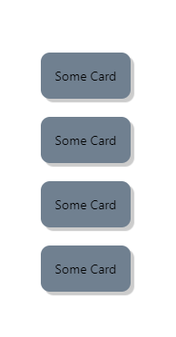
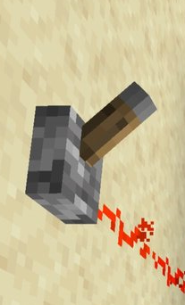

<br>

# **React Native 3**
### CS571: Building User Interfaces


<br>

#### Cole Nelson

---

# Announcements
See [@325](https://piazza.com/class/ldaxpy1obfu1b2/post/325) | [Snack Solution](https://snack.expo.dev/@ctnelson1997/in-class-example)

---

### Announcements

[Scholarships available](scholarships.wisc.edu) for *continuing CS students* until Thursday, April 13th!

<div>

 - David Dewitt Undergraduate Scholarship
 - Hina and Faisal Mushtaq Scholarship
 - Paul D Salmon Memorial Scholarship
 - Wai Ying Yick and Dr. Chiu Wai Yuen Endowment

</div>

###

[scholarships.wisc.edu](scholarships.wisc.edu)

---

### What will we learn today?

<div>

 - A review of animations and modals
 - Making a custom component
 - Using simple gestures
 - Using switches
 - Using React Navigation

</div>

---

### Animations using `Animated`

Provides *visual aesthetics* and *feedback*.

```jsx
import { Animated } from 'react-native'
```

May also consider using a third-party-library like [react-native-reanimated](https://www.npmjs.com/package/react-native-reanimated) or [lottie](https://www.npmjs.com/package/lottie-react-native).

[Animated Docs](https://reactnative.dev/docs/animated)

---

### Animated

`Animated` provides animations for...

<div>

 - `View`
 - `Text`
 - `Image`
 - `ScrollView`
 - `FlatList`
 - `SectionList`

</div>

... e.g. `<Animated.View>{/* ... */}</Animated.View>`

---

# Demos
In class, we built/went through several demos...

<div>

 - [Simple Animated Demo](https://snack.expo.dev/@ctnelson1997/animated-example)
 - [Complex Animated Demo](https://snack.expo.dev/@ctnelson1997/c4b776)
 - [Find My Badgers Animated Demo](https://snack.expo.dev/@ctnelson1997/findmybadgers-animated)
 - [Find My Badgers Animated Demo w/ Modal](https://snack.expo.dev/@ctnelson1997/findmybadgers-animated-modal)

</div>

---

### Modal

A secondary window.

```jsx
import { Modal } from 'react-native'
```

Alternative: [react-native-modal](https://www.npmjs.com/package//react-native-modal)


---

### Modal

What you need...

<div>

 1. Something to open the modal
 2. Some content inside the modal
 3. Something to close the modal

</div>

###

We often manage whether the modal is open or closed using a state variable, e.g.

```jsx
const [modalVisible, setModalVisible] = useState(false);
```


---

### Modal Properties

 - `animationType`: 'slide', 'fade', 'none'
 - `onShow`: callback func
 - `onRequestClose`: callback func
 - `transparent`: true/false
 - `visible`: true/false often handled by a state variable

[Modal Docs](https://reactnative.dev/docs/modal) | [Modal Snack](https://snack.expo.dev/@ctnelson1997/modal-example)

---

# FindMyBadgers Demo
As a React Native app with animations and modals.

[Snack Solution](https://snack.expo.dev/@ctnelson1997/findmybadgers-animated-modal)


---

### Card

React Native does not have the concept of a "card"...

1. Use a third-party library like [`react-native-paper`](https://callstack.github.io/react-native-paper/4.0/card.html).

2. Create our own component!




---

### Card

```jsx
export default function BadgerCard(props) {
    return <Pressable onPress={props.onPress}>
        <View style={[styles.card, props.style]}>
            {props.children}
        </View>
    </Pressable>
}
```

[Pressable](https://reactnative.dev/docs/pressable) | [React Native Paper Card]((https://callstack.github.io/react-native-paper/4.0/card.html))

---

### Card

Adding in the `styles.card`...

```jsx
const styles = StyleSheet.create({
    card: {
        padding: 16,
        elevation: 5,
        borderRadius: 10,
        backgroundColor: 'slategray',
    }
})
```

---

### Card

Using the BadgerCard...

```jsx
function App() {
  return <View style={styles.main}>
    <BadgerCard
      onPress={() => Alert.alert("Hello", "World!")}
      style={{backgroundColor: "red"}}
    >
      <Text>Testing Custom Card</Text>
    </BadgerCard>
  </View>
};
```

---

### Adding Gestures

```jsx
export default function BadgerCard(props) {
    return <Pressable
      onPress={props.onPress}
      onLongPress={props.onLongPress}
    >
        <View style={[styles.card, props.style]}>
            {props.children}
        </View>
    </Pressable>
}
```

[Snack Solution](https://snack.expo.dev/@ctnelson1997/badgercard)

---

### Your turn!

Create an app that contains a card with only a few words, such as `lorem ipsum`. 

When pressed, this card should open a modal that contains even more words such as `lorem ipsum dolor sit...` Allow the user to then close this modal.

**Bonus:** Can you animate the text?

[Snack Solution](https://snack.expo.dev/@ctnelson1997/badgercard-lorem-ipsum)

---

### Switch

<!--  -->


Oops! We forgot to cover an input component `Switch`.

<div>

 - `value` boolean value of on/off
 - `onValueChange` callback function

</div>

---

### Switch

```jsx
<Switch
  trackColor={{true: 'darksalmon', false: 'lightgrey'}}
  thumbColor={isOn ? 'crimson' : 'grey'}
  onValueChange={toggle} // callback function
  value={isOn} // boolean state variable
/>
```

[Snack Solution](https://snack.expo.dev/@ctnelson1997/switch)

---

### React **Native**

Things that differentiate mobile from the web...

<div>

 - **Animations**
 - **Gestures** < More Next Week!
 - Navigation < Today!
 - Sensing < Next Week!

</div>

---

# Navigation in React Native
A more mobile-centric library.

---

### React Navigation Alternatives

React Native is a framework* but still lacks support for things like navigation.

<div>

 - [React Router](https://reactrouter.com/en/main) previously!
 - [React Navigation](https://reactnavigation.org/) new!
 - `return isHome ? <HomeScreen> : <SettingsScreen>`
 - Other outdated libraries...

</div>

---

### React Navigation Installation

Just a few dependencies...

```bash
npm install @react-navigation/native react-native-screens react-native-paper 
react-native-safe-area-context react-native-gesture-handler
react-native-reanimated  @react-navigation/native-stack 
@react-navigation/drawer @react-navigation/bottom-tabs
```

**This is done for you on the homeworks.**

Beware of your auto-imports!

---

### React Navigation

We will use...

- Tab Navigation: `@react-navigation/bottom-tabs`
- Drawer Navigation: `@react-navigation/drawer`
- Stack Navigation: `@react-navigation/native-stack `


...others exist!

---

### Navigation Basics

<div>

 - Must be nested inside of a `NavigationContainer`
 - Create navigators via a function `createNAVIGATOR()` e.g. `createBottomTabNavigator()`
 - Navigators consist of a *navigator* and a set of *screens*

 ```javascript
<NavigationContainer>
  <SomeNav.Navigator>
    <SomeNav.Screen name="Bookstore" component={BookstoreScreen}/>
    <SomeNav.Screen name="Book" component={BookScreen}/>
  </SomeNav.Navigator>
</NavigationContainer>
 ```


</div>


---

### Navigation Basics

 - `useNavigation` is a custom React hook that can be used to help us navigate
   - Supports `navigate`, `reset`, `goBack` among others
 - Information can be passed from screen to screen via *route params* (see Native Stack Navigator example)
 - Navigators can be styled
 - Navigators can be nested

---

### Tab Navigation

```javascript
const SocialTabs = createBottomTabNavigator();

<NavigationContainer>
  <SocialTabs.Navigator>
    <SocialTabs.Screen name="NewsFeed" component={NewsFeedScreen}/>
    <SocialTabs.Screen name="Notifications" component={NotificationScreen}/>
    <SocialTabs.Screen name="AboutMe" component={AboutMeScreen} />
  </SocialTabs.Navigator>
</NavigationContainer>
```

[Expo Snack Solution](https://snack.expo.dev/@ctnelson1997/tab-navigation)

---

### Drawer Navigation

```javascript
const SocialDrawer = createDrawerNavigator();

<NavigationContainer>
  <SocialDrawer.Navigator>
    <SocialDrawer.Screen name="NewsFeed" component={NewsFeedScreen}/>
    <SocialDrawer.Screen name="Notifications" component={NotificationScreen}/>
    <SocialDrawer.Screen name="AboutMe" component={AboutMeScreen} />
  </SocialDrawer.Navigator>
</NavigationContainer>
```

[Expo Snack Solution](https://snack.expo.dev/@ctnelson1997/drawer-navigation)

---

### Stack Navigation

```javascript
const BookStack = createNativeStackNavigator();

<NavigationContainer>
  <BookStack.Navigator>
    <BookStack.Screen name="Bookstore" component={BookstoreScreen}/>
    <BookStack.Screen name="Book" component={BookScreen}/>
  </BookStack.Navigator>
</NavigationContainer>
```

[Expo Snack Solution](https://snack.expo.dev/@ctnelson1997/stack-navigation)

---

### Stack Navigation

Can push a screen onto the history stack via `navigation.push(screenName, params)`
 - `screenName` is the name of the screen to navigate to, e.g. `Book`
 - `params` is an optional object of parameters to pass to the receiving screen.
 - `params` is recieved  as `props.route.params`

---

### Nested Navigation

<div>

 - Navigators can be nested.
   - Stack in Tabs
   - Stack in Drawer
   - Stack in Tabs in Drawer (e.g. Example Below)
   - Stack in Stack in Tabs
   - Stack in Stack in Stack in Stack in Stack
 - Make use of the `headerShown` option!

</div>

[Expo Snack Solution](https://snack.expo.dev/@ctnelson1997/nested-navigation)

---

### A Note on Expo

Expo is a library for quickly getting started with React Native projects. No need to...

<div>

 - cocoa pods install ❌
 - maven/gradle building ❌
 - react native linking ❌

</div>

You may need to use specific expo libraries, such as [@expo/vector-icons](https://docs.expo.dev/guides/icons/)

---

### What did we learn today?

<div>

 - A review of animations and modals
 - Making a custom component
 - Using simple gestures
 - Using switches
 - Using React Navigation

</div>

---

# Questions?
