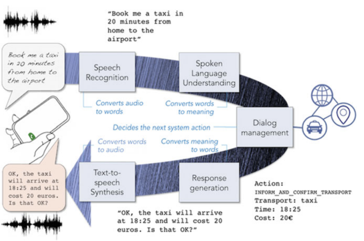
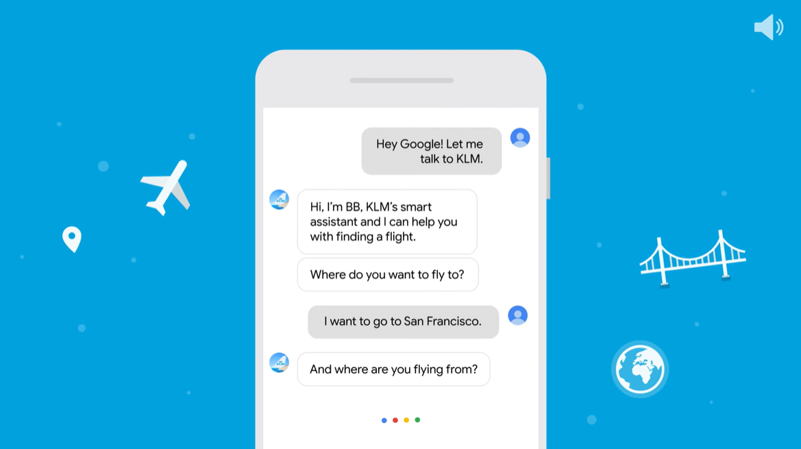
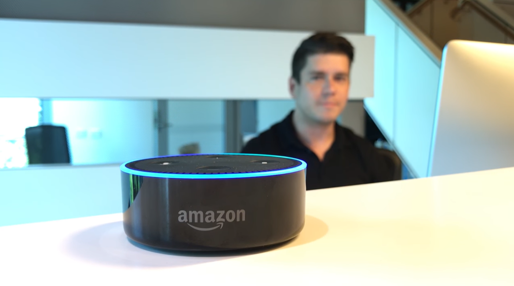
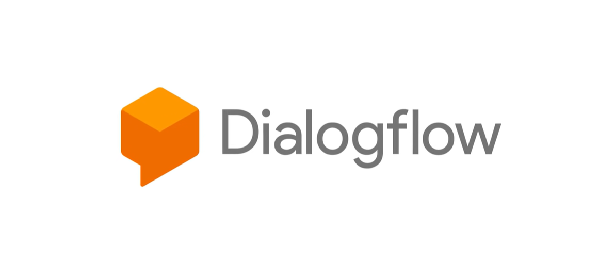
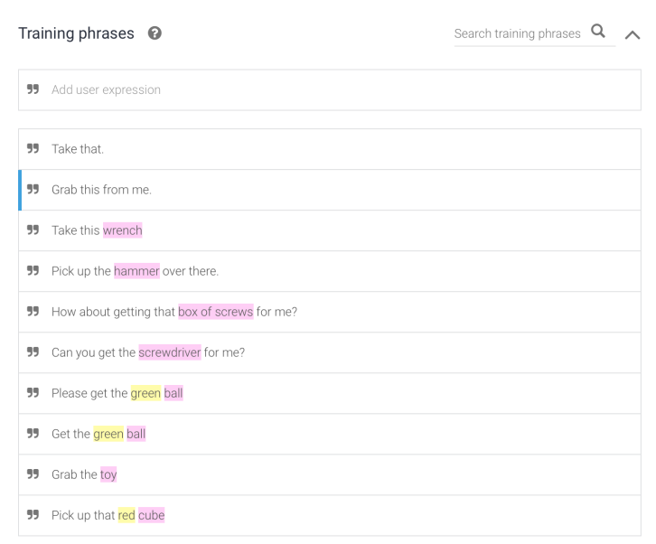
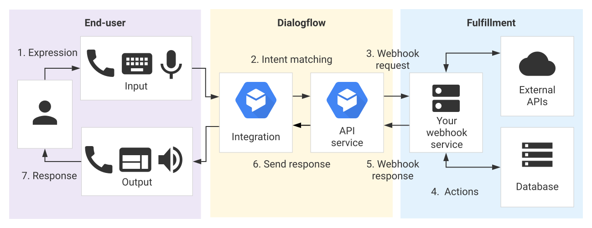
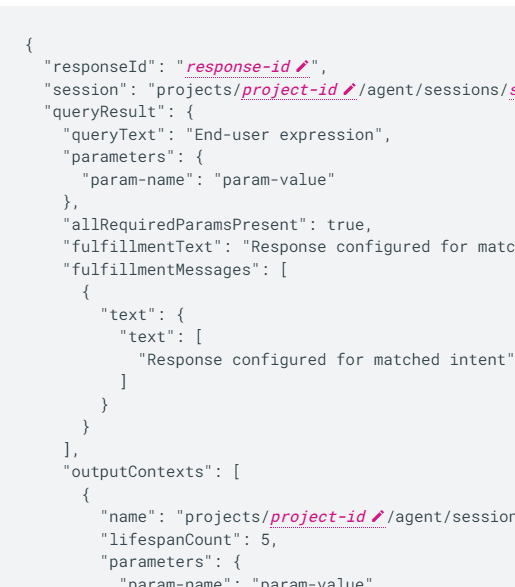

 

# **DialogFlow 1**
### CS571: Building User Interfaces

 

#### Cole Nelson

---

### Announcements
 - Final exam held on **Tuesday, May 9th 7:30-9:00pm** in Humanities 2340.
   - 1 sheet of standard-size double-sided notes.
   - 40 MC worth 20 pts.
 - Please [fill out this form](https://docs.google.com/forms/d/e/1FAIpQLScKd3TDXAcnNGUoi6BVGza2my1by3kMj7okHqrmOtyfqdjmHQ/viewform) by **May 1st** if you will not be able to make the exam. An HonorLock alternative will be used.

---

### Announcements

 - HW11 is due Monday, 4/24, late week of 5/1.
 - HW12 is "due" Monday, 5/1, no-cost late week of 5/8. Cannot be extended further.
 - Bonus Quiz worth 1 pt for the final week of class.
   - Final week of class' content will *only* be on the Bonus Quiz, not on the Final Exam.

---

### Announcements
 - End of semester survey opens 4/21 and closes 5/5 at [aefis.wisc.edu](https://aefis.wisc.edu/).
   - All responses are anonymous.
   - Optional, but highly encouraged!
 - [NPM library usage](https://canvas.wisc.edu/courses/345833/assignments/1780217) due Wednesday, May 3rd.
   - No late weeks can be used!
   - You may go back and modify a previous homework.
   - Can be used on DialogFlow as well!

---

# HW11 Walkthrough
[Link to Canvas assignment.](https://canvas.wisc.edu/courses/345833/assignments/1780197)

---

### What will we learn today?

 - What are VUIs?
 - What are their potential applications?
 - How can we use DialogFlow to create VUIs?
 - An Introduction to DialogFlow Webhook Fulfillment

---

### Voice User Interfaces

VUIs are a common form of **agent-based design** as opposed to **direct manipulation**.

Conversational interfaces can be used to...

→ Address accessibility needs
→ Address context-specific problems (e.g. driving)
→ Augment the user experience

---

### Voice User Interfaces

VUIs integrate a number of technologies and ideas...

1. Speech recognition
2. Spoken language understanding
3. Dialog management
4. Response generation
5. Text-to-speech synthesis

[McTear et. al. 2016](https://link.springer.com/chapter/10.1007/978-3-319-32967-3_4)

---

 
 
 
 
 
 
 
 
 
 

[McTear et. al. 2016](https://link.springer.com/chapter/10.1007/978-3-319-32967-3_4)

---

# Potential Applications
Where can I use my Voice Agent?

---

[Find KLM flights on the Google Assistant](https://www.youtube.com/watch?v=dshqRotorvM)

---

[Order Domino's with Alexa!](https://www.youtube.com/watch?v=AXw9ccXNU6Q)

---

### Implementation Options

We focus on just one avenue of implementation!

 - [DialogFlow](https://cloud.google.com/dialogflow/docs) by Google
 - [Wit.ai](https://wit.ai/) by Facebook
 - [Watson Assistant](https://www.ibm.com/products/watson-assistant) by IBM
 - [Lex](https://aws.amazon.com/lex/) by Amazon
 - [Azure Bot Service](https://azure.microsoft.com/en-us/products/bot-services/) by Microsoft

 

A Consideration: [Killed by Google](https://killedbygoogle.com/)

---

[Intro to Dialogflow](https://www.youtube.com/watch?v=yT58gTXdQb8)

---

### Key Concepts in DialogFlow

 - Agents
   - Intents
     - Training Phrases
     - Parameters
     - Responses
   - Entities

---

### Agents

Agents are high-level containers for a number of building blocks...

 - Agent settings
 - Intents
 - Entities
 - Integrations
 - Fulfillment

Think of it like a project!

---

### Intents

Consider the following user requests...

 - What is the weather like today?
 - Will it rain sometime today?

###

What is the intent of these requests?

---

### Intents

The goals of the user that are expressed to the agent.

Consists of training phrases, parameters (optional), and responses.

[Image Source](https://cloud.google.com/dialogflow/es/docs/intents-overview)

---

### Intents

**Training Phrases:** Things the user may say to express an intent. DialogFlow recommends having many!

**Parameters:** Things that may vary in an expression, e.g. time, quantity, location.

**Responses**: How the system responds to the expression. Can include text, buttons, links, etc!

---

         

[Image Source](https://cloud.google.com/dialogflow/es/docs/intents-overview)

---

### Fallback Intent

A special type of intent that dictates how the agent responds if an expression cannot match an intent.

 e.g. "Sorry, I didn't get that."

---

### Parameters, Entity Types, and Entities

These allow for more specificity of requests without exploding the intent space.

 - **Parameter:** A variable to be expressed by the user
 - **Entity Type:** The type of variable expressed
 - **Entity:** A specific value that can be expressed

---

### Example

Consider the following expression...

What is the weather like today in Seattle?

 - **Intent:** weather inquiry
 - **Parameter** city name
 - **Entity Type:** geolocation
 - **Entity:** Seattle

---

### Activity

Identify intents, parameters, and entity types of parameters in the following training phrases. Then, identify possible entities and write potential responses.

 - How are you?
 - How do I get to Middleton?
 - What is the price of a basketball?
 - Buy one box of tissues from Amazon.

---

### Entities

Entities can  have *synonyms*, e.g. green onions are also known as spring onions or scallions. 

Entities can be *fuzzy-matched*, e.g. gween onion is probably misspelled green onion.

Entities can be *automatically expanded*, e.g. if saw and hammer are tools, drill likely is too.

---

---

# Let's Build an Agent!
[Using DialogFlow ES](https://dialogflow.cloud.google.com/) for a Joke VUI

---

### DialogFlow Advanced Concepts

 - WebHook Fulfillment < Brief Intro!
 - Contexts
   - Followup Intents
 - Integrations
 - Events

---

# Webhook Fulfillment
Doing something "smart" with our agent.

---

         

[Image Source](https://cloud.google.com/dialogflow/es/docs/fulfillment-overview)

---

### Webhook Fulfillment

Many reasons to use webhook fulfillment...

 - Used instead of giving static responses.
 - Interact with backend APIs and databases.
 - Provides the business logic for the agent.

---

### Types of Webhook Fulfillment

---

### Creating a Webhook

Many, many, many options!

 - Google Cloud Functions
 - AWS Lambdas
 - C# & .NET
 - Java & Spring
 - Python & Flask
 - **JavaScript & Express**

---

# Creating a Server/Webhook
Quick Intro to Backend Development

 - [Example Express Server](https://expressjs.com/en/starter/hello-world.html)

 - [HW10 API](https://github.com/CS571-S23/hw10-api)

---

### DialogFlow Webhook

DialogFlow makes a POST *request* to `/`.

[Explore Docs](https://cloud.google.com/dialogflow/es/docs/fulfillment-webhook#webhook_request)

---

# Let's Create a Server!
[Hello World from DialogFlow](https://github.com/CS571-S23/week13-df1-inclass-example)

---

### What did we learn today?

 - What are VUIs?
 - What are their potential applications?
 - How can we use DialogFlow to create VUIs?
 - An Introduction to DialogFlow Webhook Fulfillment

---

## Questions?
