# **Building Secure UIs**
### CS571: Building User Interfaces

###

#### Cole Nelson

---

# Announcements
See "No Title" Announcement

---

### What will we learn today?

<div>

 - How to (not) end up in jail?
 - What are bug bounty programs?
 - What are the OWASP Top 10?
 - How do XSS attacks work?
 - How do vulnerable dependencies create risk?
 - Why is client-side validation insufficient?
 - What are common mitigation strategies?

</div>

---

### A Disclaimer

*a badger wearing a red shirt with a w on it in jail for committing cybercrimes, pixel art*

###

generated using [DALL-E](https://openai.com/product/dall-e-2)


---

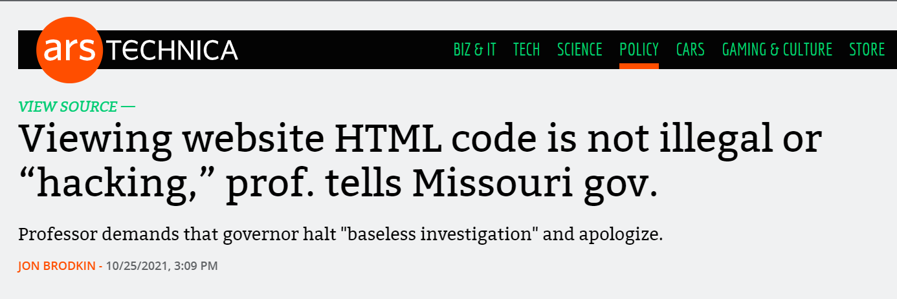

---


---

### Building Secure User Interfaces

Make sure you have permission to resources before performing security audits!

###

<div>

 - [HackerOne](https://www.hackerone.com/)
 - [OpenBugBounty](https://www.openbugbounty.org/)
 - [BugCrowd](https://www.bugcrowd.com/)

</div>

###

Look for **safe harbors** or **local resources**.

---


---

<div>

### OWASP Top 10 (2021)

1. Broken Access Control
2. Cryptographic Failures
3. Injection
4. Insecure Design
5. Security Misconfiguration

</div>


---

### OWASP Top 10 (2021)

<div>

6. Vulnerable and Outdated Components
7. Identification and Authentication Failures
8. Software and Data Integrity Failures
9. Security Logging and Monitoring Failures
10. Server-Side Request Forgery

</div>

---

### Common Vulnerabilities

Vulnerabilities affect both frontends *and* backends!


Today we will look at...

<div>

 - Cross-Site Scripting (XSS)
   - Reflected/DOM-based XSS
   - Persistent XSS
 - Vulnerable and Outdated Components
 - Software and Data Integrity Failures 

</div>

---

# XSS

---

### Cross-Site Scripting (XSS)

Cross-Site Scripting (XSS) attacks are a type of injection, in which malicious scripts are injected into otherwise benign and trusted websites. XSS attacks occur when an attacker uses a web application to send malicious code, generally in the form of a browser side script, to a different end user. 

[OWASP Definition](https://owasp.org/www-community/attacks/xss/)


---

### HW2 XSS

Render each student using `innerHtml`

```jsx
let html = "<div>";
html += `<h2>${student.name}</h2>`;
html += "</div>";
return html;
```


---

### HW2 XSS

When input is `Michael`...

```html
<div>
  <h2>Michael</h2>
</div>
```

`<i>Michael</i>`...

```html
<div>
  <h2><i>Michael<i></h2>
</div>
```

---

### HW2 XSS

`<script>alert("oops!")\</script>`...

```html
<div>
  <h2><script>alert("oops!")</script></h2>
</div>
```

``...

```html
<div>
  <h2></h2>
</div>
```

--- 

### DOM-based vs Persistent XSS

DOM-based XSS
```
https://example.com/search?q=%3Cimg%20src=%220%22%20onerror=%22alert(1)%22/%3E
```

Persistent XSS

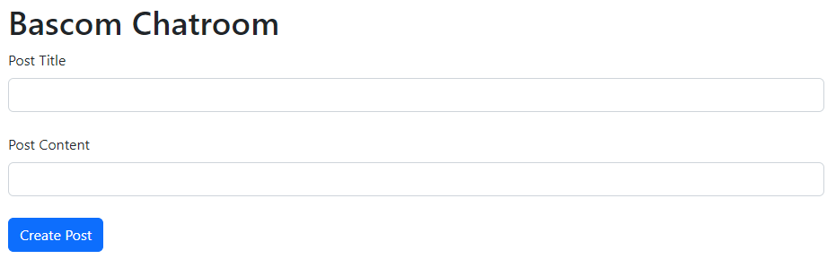


---

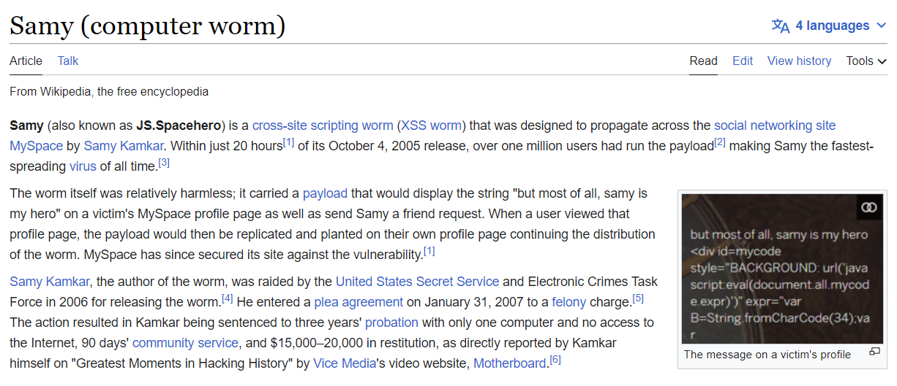

---

# XSS Demo w/ JuiceShop
[Download here!](https://owasp.org/www-project-juice-shop/)

---

### XSS Mitigations

Sanitize your inputs!

Do not create a sanitizer yourself!

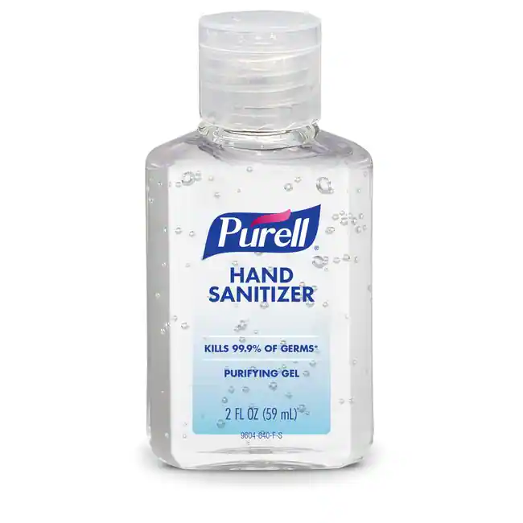

React [performs sanitization](https://legacy.reactjs.org/docs/dom-elements.html#dangerouslysetinnerhtml) for you.


<sub><sup>[Image Source](https://www.fishersci.com/shop/products/purell-advanced-hand-sanitizer-gel-6/p-7159163)</sup></sub>

---

# XSS Demo w/ BadgerChat
BadgerChat is *NOT* a safe harbor -- please ask for permission before pentesting.

---

# Use of Outdated and Vulnerable Components


---

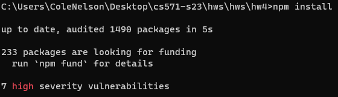

---

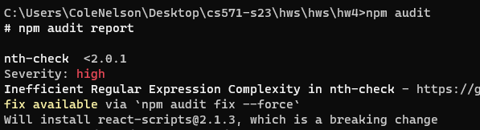

---

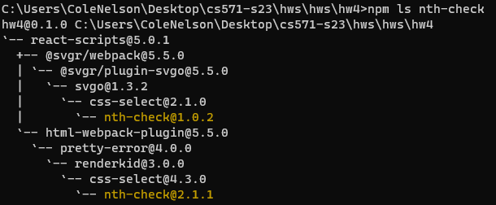

---

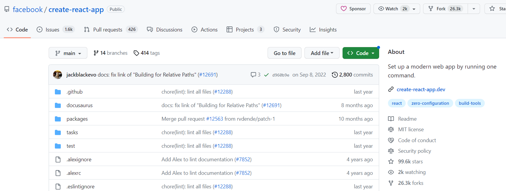

---

### Outdated and Vulnerable Components

A vulnerable dependency does not *necessarily* mean the application is vulnerable.

Likewise, an application without vulnerable dependencies *could still* be vulnerable.

Vulnerable dependencies are *flags* to look into.

---

### Checking Vulnerabilities

Check the CVE (Common Vulnerabilities and Exposures)

e.g. CVE-2021-3803...

<div>

 - [NIST](https://nvd.nist.gov/vuln/detail/CVE-2021-3803)
 - [GitHub](https://github.com/advisories/GHSA-rp65-9cf3-cjxr)
 - [Snyk](https://security.snyk.io/vuln/SNYK-JS-NTHCHECK-1586032)

</div>

###

Does it have to be in the production build? Can it be specified as a [dev dependency](https://docs.npmjs.com/specifying-dependencies-and-devdependencies-in-a-package-json-file)?

---


---

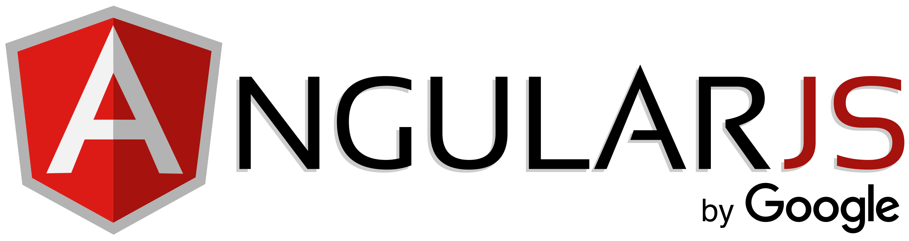

---

### Outdated Dependency Mitigations

Keep your dependencies up-to-date!

<div>

 - Static Analysis (SAST) Tools
   - [OWASP DependencyCheck](https://owasp.org/www-project-dependency-check/)
 - Continuous Maintenance
 - Minimize Surface Area

</div>

###

Beware of changing technologies!

---

# Software and Data Integrity Failures

---

### Validation

Frontends are just a way of getting to the backend!

**Do not rely solely on frontend validation.**

The user can send more than you allow them to.

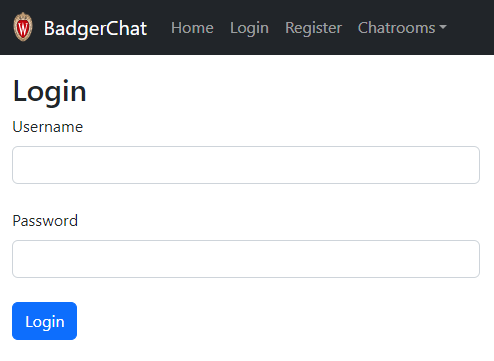


---

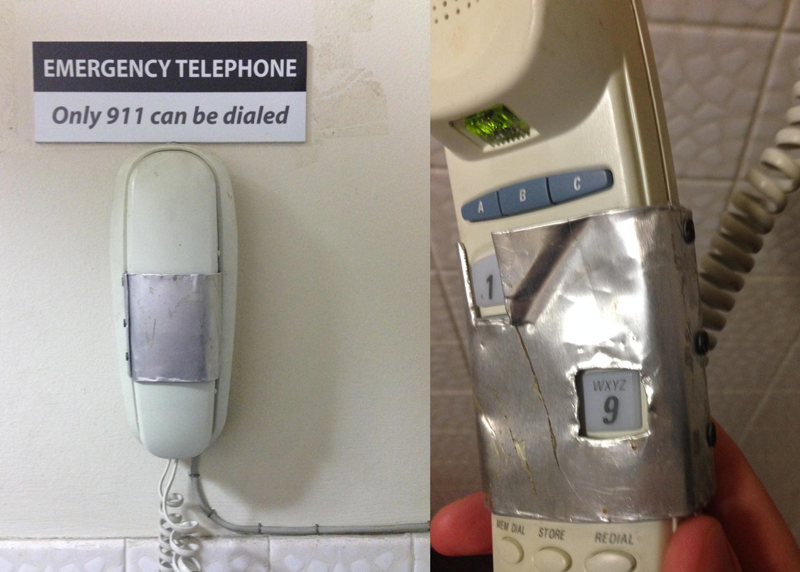

<br/><br/><br/><br/><br/><br/><br/><br/><br/>


<sub><sup>[Image Source](https://www.reddit.com/r/ProgrammerHumor/comments/5gvawb/client_side_validation/)</sup></sub>

---

# Software and Data Integrity Failure Demo

On [OWASP JuiceShop](https://owasp.org/www-project-juice-shop/) using [OWASP ZAP](https://owasp.org/www-project-zap/)

---


# Backend Vulnerabilities
Where the real treasure lies!

---


<br/><br/><br/><br/><br/><br/><br/><br/>

[XKCD 327](https://xkcd.com/327/)

---

### Mitigation Strategies

Technical strategies may include...

<div>

 - Obfuscation
 - Web Application Firewall (WAF)
 - Containerization (Using [Docker](https://www.docker.com/) or [VMs](https://www.virtualbox.org/))
 - Defense in Depth (Swiss Cheese Approach)

</div>

---

### Mitigation Strategies

Non-technical strategies may include...

<div>

 - Threat Modeling
 - Least Privilege
 - Scary Messages
 - Ask Nicely :)

</div>

---

# Questions?
