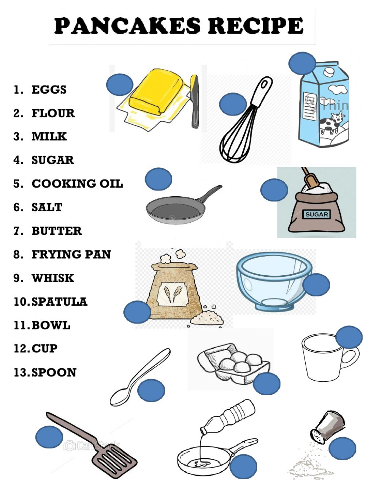
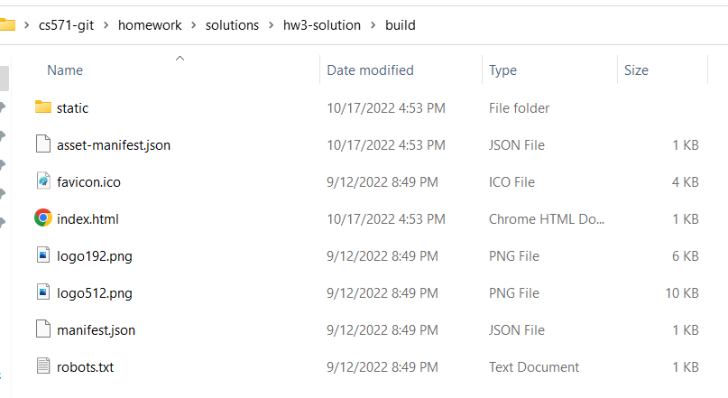
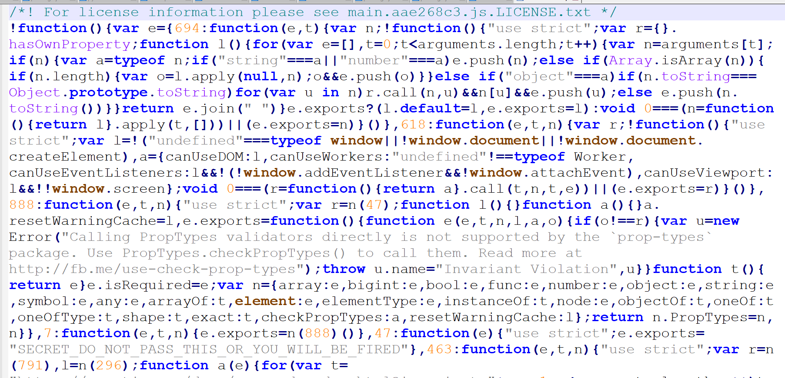
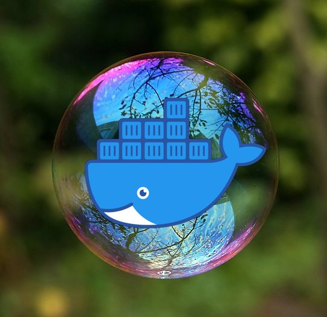
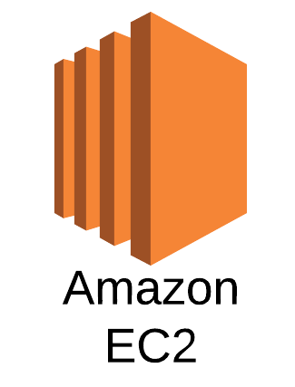
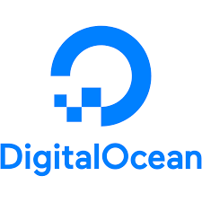

# **Fullstack Development**
### CS571: Building User Interfaces

**Warmup:** Download [today's starter code](https://github.com/CS571-S23/week15-fullstack-demo) and [install Docker](https://www.docker.com/) on your computer!

#### Cole Nelson

---

# Announcements
See "No Title" Announcement

---

### What will we learn today?

<div>

 - What is the software stack?
 - How do we deploy a frontend?
 - How can we use containerization?
 - How can we develop a backend?
 - How can we persist data?
 - What are other considerations?

</div>

---

### Software Stack


Think of software like a stack of pancakes...

[Image Source](https://www.pinterest.com/pin/looking-for-a-full-stack-developer-weve-got-you-covered--456693218441395202/)

---

### Software Stack


... where each pancake can be its own flavor...

[Image Source](https://cookingwithmammac.com/flavored-pancakes/)

---

### Software Stack

... and can be cooked its own way...



[Image Source](https://www.liveworksheets.com/worksheets/en/English_as_a_Second_Language_(ESL)/Recipes/Lets_make_pancakes_ty1088539hd)

---

### Software Stack

... with as many or as few as we want!


[Image Source](https://www.goodhousekeeping.com/uk/food/a552834/this-stack-of-pancakes-has-2500-calories/)

---

### The Browser


However, we are constrained to what the browser can interpret...

<div>

 - HTML
 - CSS
 - JS

</div>

---


### Delivery of React App
We don't deliver our JSX code, we deliver HTML, CSS, and JS generated via `npm run build`!

Also, specify a home page (absolute or relative)...

```json
{
  "name": "hw3",
  "version": "0.1.0",
  "private": true,
  "homepage": "https://coletnelson.us/mycoolapp/",
  "dependencies": {
    ...
  }
}
```

---



---

```html
<html lang="en">
  <head>
    <meta charset="utf-8" />
    <link rel="icon" href="./favicon.ico" />
    <meta name="viewport" content="width=device-width,initial-scale=1" />
    <meta name="theme-color" content="#000000" />
    <meta name="description" content="Web site created using create-react-app" />
    <link rel="apple-touch-icon" href="./logo192.png" />
    <link rel="manifest" href="./manifest.json" />
    <title>React App</title>
    <script defer="defer" src="./static/js/main.aae268c3.js"></script>
    <link href="./static/css/main.ace4cd11.css" rel="stylesheet">
  </head>
  <body><noscript>You need to enable JavaScript to run this app.</noscript>
    <div id="root"></div>
  </body>
</html>
```

---



---

### Build Bundle Deployment

<br><br><br><br><br><br><br>


<sub><sup>Not an endorsement of any particular service.</sup></sub>

---

# Let's deploy [cs571.org](https://cs571.org/)!

---

# This is great but...
...dragging and dropping files?? Really??

---




---


<br><br><br><br><br><br><br><br><br>

<sub><sup>[Image Source](https://cto.ai/blog/docker-image-vs-container-vs-dockerfile/)</sup></sub>

---

# Let's Build & Deploy **BadgerChat Basic**

---

# How to persist data?
Building a backend!

---

### Creating a Backend Server

Many, many, many options!

<div>

 - Google Cloud Functions
 - AWS Lambdas
 - C# & .NET
 - Java & Spring
 - Python & Flask
 - **JavaScript & Express**

</div>


---

# Let's Build an API!
Using JavaScript & Express

---

# How to persist data?
Let's use [SQLite](https://sqlite.org/index.html)

---

### SQLite

 - SQL, but lite!
 - Creates a `.db` file on your machine
 - Is not a "hosted" database, but is good for quick projects and hacks!
 - Handles our concurrency issues.


---

### Backend Server Hosting

<br><br><br><br><br><br><br>

<sub><sup>Not an endorsement of any particular service.</sup></sub>





---

### Other Considerations

 - Use [Jenkins](https://www.jenkins.io/) or some other CICD platform to create a [build and deploy pipeline](https://www.youtube.com/watch?v=x9l6yw1PFbs).
   - Include testing as an automated step.
 - Use HTTPS for a secure HTTP connection.
   - Consider [LetsEncrpyt](https://letsencrypt.org/).
 - Buy a domain name?
   - Completely optional!
---

### What's Next?
**CS570** Introduction to Human-Computer Interaction 
   → explore UX methods (research, design, evaluation)

###

**CS770** Human-Computer Interaction 
→ core topics and research methods in HCI research

###

See also [hci.cs.wisc.edu](https://hci.cs.wisc.edu/).

---

### What did we learn today?

<div>

 - What is the software stack?
 - How do we deploy a frontend?
 - How can we use containerization?
 - How can we develop a backend?
 - How can we persist data?
 - What are other considerations?
 
</div>

---

# Thank you! :)
